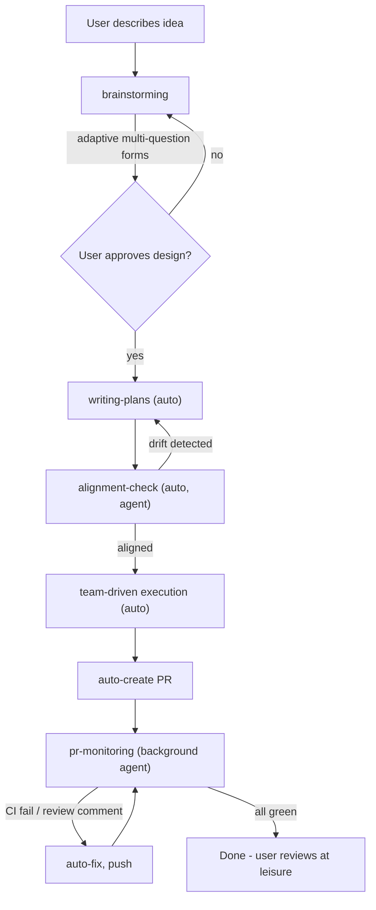
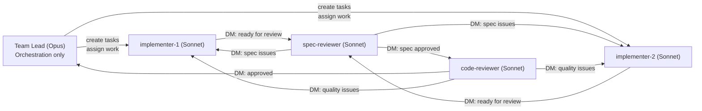

# Alignment, Autonomy & Agent Teams Design

> **Date:** 2026-03-04
> **Status:** Approved

## Goal

Enhance claude-superpowers with three capabilities: (1) design-to-plan alignment verification, (2) Agent Teams as the default execution mode, and (3) full autonomy after design approval including automated PR monitoring.

## Architecture

Evolutionary refactor of existing skills plus two new skills (`alignment-check`, `pr-monitoring`). The current composable skill architecture is preserved. Agent Teams is the default execution strategy when available, with subagent fallback.

## End-to-End Workflow

User's last interaction: approving the design. Everything after runs autonomously.

## Feature 1: Alignment Check

New skill `alignment-check` dispatches a Sonnet agent that reads both the design doc and plan doc, comparing:

- Every design requirement has a corresponding plan task
- No plan tasks exist without a design requirement (scope creep)
- No design requirements are missing from the plan (scope omission)

Output: PASS (proceed) or FAIL with specific drift items fed back to `writing-plans` for revision. Max 2 revision cycles before escalating to user (safety valve).

## Feature 2: Agent Teams as Default Execution

### Team Topology

- **Lead (Opus):** Orchestration only via delegate mode. Creates tasks from plan, monitors progress, reassigns if stuck.
- **Implementers (Sonnet):** Claim tasks from shared task list, work in worktree isolation, commit. DM spec-reviewer when done.
- **Spec-reviewer (Sonnet):** Receives DMs from implementers. Compares implementation against design doc. Passes to code-reviewer or sends back with issues.
- **Code-reviewer (Sonnet):** Uses existing `code-reviewer` agent definition. Reviews code quality. Marks task complete or sends back.

### Scaling

| Plan tasks | Implementers |
|-----------|-------------|
| 1-5       | 1           |
| 6-15      | 2           |
| 16+       | 3           |

### Detection & Fallback

Check for Agent Teams availability (TeamCreate tool presence or `CLAUDE_CODE_EXPERIMENTAL_AGENT_TEAMS` env var). When unavailable, fall back to the existing sequential subagent flow.

### Communication Flow Per Task

1. Implementer claims task from TaskList
2. Implementer works: TDD, tests pass, commits to worktree
3. Implementer DMs spec-reviewer: "Task X ready for review" + context
4. Spec-reviewer reviews against design doc
   - PASS: DMs code-reviewer
   - FAIL: DMs implementer with issues, implementer fixes
5. Code-reviewer reviews code quality
   - PASS: Marks task complete via TaskUpdate
   - FAIL: DMs implementer with issues, implementer fixes
6. Lead sees task completion, checks for newly unblocked tasks

## Feature 3: Full Autonomy After Design

### Modified Skills

**`brainstorming`:**
- Adaptive multi-question forms (2-4 questions per AskUserQuestion call)
- First form: grouped questions covering purpose, constraints, scope, tech
- Follow-ups: targeted singles based on interesting answers
- After design approval: auto-invoke `writing-plans` with `autonomous: true` context

**`writing-plans`:**
- In autonomous mode: skip user plan review, write plan directly
- After writing: invoke `alignment-check` instead of waiting for user

**`subagent-driven-development`:**
- Detect Agent Teams, use team topology when available
- Lead creates all tasks with dependencies upfront
- Spawns role-based team, then monitors
- On completion: invoke `finishing-a-development-branch` in auto mode

**`finishing-a-development-branch`:**
- In autonomous mode: skip 4-option menu
- Auto-push branch, auto-create PR via `gh pr create`
- PR body: design doc link, plan summary, per-task status
- After PR creation: invoke `pr-monitoring`

### New Skills

**`alignment-check`:**
- Agent reads design doc + plan doc
- Structured comparison (requirements coverage, scope drift)
- PASS/FAIL with specific items
- Max 2 revision loops, then escalate

**`pr-monitoring`:**
- Background agent polls PR every 60s
- Monitors CI checks (`gh pr checks`) and review comments (`gh api`)
- CI failure: reads logs, creates fix, pushes
- Review comment: reads comment, implements change, responds, pushes
- Safety limits: max 5 CI fix attempts, max 3 revision rounds per comment
- Exit: all checks green + no unresolved comments

## Files to Create/Modify

| File | Action |
|------|--------|
| `skills/brainstorming/SKILL.md` | Modify: adaptive multi-question, auto-handoff |
| `skills/writing-plans/SKILL.md` | Modify: auto mode, alignment-check invocation |
| `skills/subagent-driven-development/SKILL.md` | Modify: Agent Teams default, subagent fallback |
| `skills/subagent-driven-development/implementer-prompt.md` | Modify: team messaging |
| `skills/subagent-driven-development/spec-reviewer-prompt.md` | Modify: team messaging |
| `skills/subagent-driven-development/code-quality-reviewer-prompt.md` | Modify: team messaging |
| `skills/finishing-a-development-branch/SKILL.md` | Modify: auto-PR path |
| `skills/alignment-check/SKILL.md` | Create |
| `skills/pr-monitoring/SKILL.md` | Create |
| `skills/using-superpowers/SKILL.md` | Modify: updated workflow, new skills |
