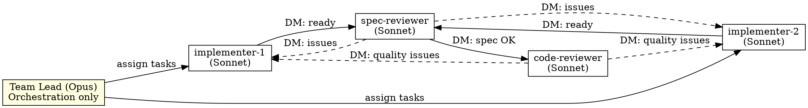

# Alignment, Autonomy & Agent Teams Implementation Plan

> **For Claude:** REQUIRED SUB-SKILL: Use superpowers:executing-plans to implement this plan task-by-task.

**Goal:** Add design-to-plan alignment verification, Agent Teams as the default execution mode, and full autonomy after design approval with automated PR monitoring.

**Architecture:** Evolutionary refactor — modify 6 existing skills, create 2 new skills. Agent Teams is the default when available; subagent fallback preserved. Autonomy flag propagates from brainstorming through the pipeline. New alignment-check and pr-monitoring skills slot into the existing composable workflow.

**Tech Stack:** Markdown skill files, Claude Code Agent Teams API (TeamCreate, SendMessage, TaskCreate/Update/List), gh CLI for PR operations.

**Design doc:** `docs/plans/2026-03-04-alignment-autonomy-teams-design.md`

---

### Task 1: Create `alignment-check` Skill

**Files:**
- Create: `skills/alignment-check/SKILL.md`

**Step 1: Create the skill file**

Create `skills/alignment-check/SKILL.md` with this content:

```markdown
---
name: alignment-check
description: Use after writing-plans to verify the implementation plan covers all design requirements without drift or scope creep
---

# Design-to-Plan Alignment Check

## Overview

Verify that an implementation plan faithfully covers every requirement in the approved design — nothing missing, nothing extra. This is an automated gate between planning and execution.

**Core principle:** Every design requirement maps to a plan task. Every plan task traces to a design requirement. Drift in either direction is caught before execution begins.

## When to Use

Invoked automatically by `writing-plans` in autonomous mode. Can also be invoked manually after writing a plan.

## The Process

1. **Read the design doc** — extract every requirement, constraint, and acceptance criterion
2. **Read the plan doc** — extract every task with its description and files
3. **Forward trace** — for each design requirement, find the plan task(s) that implement it
4. **Reverse trace** — for each plan task, find the design requirement it satisfies
5. **Report** — PASS or FAIL with specific items

## Dispatching the Alignment Agent

Dispatch a Sonnet agent to perform the comparison:

```
Agent tool (general-purpose, model: sonnet):
  description: "Check alignment: design vs plan"
  prompt: |
    You are verifying that an implementation plan aligns with its design document.

    ## Design Document
    [Read: docs/plans/YYYY-MM-DD-<topic>-design.md]

    ## Implementation Plan
    [Read: docs/plans/YYYY-MM-DD-<feature>.md]

    ## Your Job

    **Forward trace (design → plan):**
    For each requirement in the design:
    - Find the plan task(s) that implement it
    - If no task covers it: flag as MISSING

    **Reverse trace (plan → design):**
    For each task in the plan:
    - Find the design requirement it satisfies
    - If no requirement justifies it: flag as SCOPE CREEP

    **Report format:**

    ### Alignment Report

    **Status:** PASS | FAIL

    **Coverage:**
    | Design Requirement | Plan Task(s) | Status |
    |---|---|---|
    | [requirement] | Task N | ✅ Covered |
    | [requirement] | — | ❌ MISSING |

    **Scope Check:**
    | Plan Task | Design Requirement | Status |
    |---|---|---|
    | Task N | [requirement] | ✅ Justified |
    | Task N | — | ⚠️ SCOPE CREEP |

    **Drift Items:** [list specific items to fix]
```

## On FAIL

Feed drift items back to `writing-plans` for revision:
- MISSING requirements → add tasks
- SCOPE CREEP tasks → remove or justify

Re-run alignment check after revision. **Max 2 revision cycles** before escalating to the user with a summary of unresolved drift.

## On PASS

Proceed to execution:
- If autonomous mode: invoke `subagent-driven-development` (which uses Agent Teams)
- If manual mode: return control to user

## Integration

**Called by:**
- `writing-plans` (autonomous mode) — after plan is written
- Manual invocation — when user wants to verify alignment

**Calls:**
- `writing-plans` (on FAIL) — for plan revision
- `subagent-driven-development` (on PASS, autonomous mode) — to begin execution
```

**Step 2: Verify the file was created correctly**

Run: `cat skills/alignment-check/SKILL.md | head -5`
Expected: frontmatter with `name: alignment-check`

**Step 3: Commit**

```bash
git add skills/alignment-check/SKILL.md
git commit -m "feat: add alignment-check skill for design-to-plan verification"
```

---

### Task 2: Create `pr-monitoring` Skill

**Files:**
- Create: `skills/pr-monitoring/SKILL.md`

**Step 1: Create the skill file**

Create `skills/pr-monitoring/SKILL.md` with this content:

```markdown
---
name: pr-monitoring
description: Use after creating a PR to automatically monitor CI checks and review comments, fixing issues and pushing updates autonomously
---

# PR Monitoring

## Overview

Monitor a pull request for CI failures and review comments, automatically fixing issues and pushing updates. Runs as a background agent after autonomous PR creation.

**Core principle:** The PR is the final quality gate. Monitor it, fix what breaks, respond to feedback — all without human intervention.

## When to Use

Invoked automatically by `finishing-a-development-branch` in autonomous mode after creating a PR. Can also be invoked manually for any open PR.

## The Process

Spawn a background agent that monitors the PR in a loop:

```
Agent tool (general-purpose, model: sonnet, run_in_background: true):
  description: "Monitor PR #N for CI and reviews"
  prompt: |
    You are monitoring PR #<number> on <repo> and automatically fixing issues.

    ## Setup

    PR URL: <url>
    Branch: <branch>
    Base: <base-branch>
    Design doc: <path>
    Plan doc: <path>

    ## Monitor Loop

    Repeat until exit conditions met:

    ### 1. Check CI Status

    ```bash
    gh pr checks <number> --json name,state,conclusion
    ```

    **If any check fails:**
    a. Read the failure logs: `gh run view <run-id> --log-failed`
    b. Identify the root cause
    c. Fix the issue in the codebase
    d. Run the relevant tests locally to verify
    e. Commit and push:
       ```bash
       git add <specific-files>
       git commit -m "fix: address CI failure in <check-name>"
       git push
       ```
    f. Wait 60s, re-check

    **Safety:** Max 5 fix attempts per unique CI failure. After 5, comment on the PR:
    "Unable to automatically resolve CI failure in <check-name> after 5 attempts. Manual intervention needed."

    ### 2. Check Review Comments

    ```bash
    gh api repos/<owner>/<repo>/pulls/<number>/comments --jq '.[] | select(.position != null) | {id, body, path, line: .original_line, user: .user.login}'
    gh api repos/<owner>/<repo>/pulls/<number>/reviews --jq '.[] | select(.state == "CHANGES_REQUESTED") | {id, body, user: .user.login}'
    ```

    **If new unresolved comments found:**
    a. Read the comment carefully
    b. Implement the requested change
    c. Run tests to verify
    d. Commit and push
    e. Reply to the comment: "Addressed in <commit-sha>"

    **Safety:** Max 3 revision rounds per review comment. After 3, reply:
    "I've attempted to address this feedback but may need clarification. Flagging for manual review."

    ### 3. Check Exit Conditions

    Exit when ALL of:
    - All CI checks passing (green)
    - No unresolved review comments
    - No pending "changes requested" reviews

    On exit, report final status.

    ### 4. Wait Between Checks

    Sleep 60 seconds between check cycles. Do not poll more frequently.

## Safety Limits

| Limit | Value | On Exceed |
|-------|-------|-----------|
| CI fix attempts per failure | 5 | Comment on PR, stop fixing that check |
| Revision rounds per comment | 3 | Reply with escalation, stop revising |
| Total monitoring duration | 30 min | Exit with status report |
| Push frequency | Max 1 per 60s | Queue fixes, batch push |

## Integration

**Called by:**
- `finishing-a-development-branch` (autonomous mode) — after PR creation

**Uses:**
- `gh` CLI for all GitHub operations
- `superpowers:systematic-debugging` principles for CI failure analysis
```

**Step 2: Verify the file was created correctly**

Run: `cat skills/pr-monitoring/SKILL.md | head -5`
Expected: frontmatter with `name: pr-monitoring`

**Step 3: Commit**

```bash
git add skills/pr-monitoring/SKILL.md
git commit -m "feat: add pr-monitoring skill for autonomous CI and review handling"
```

---

### Task 3: Modify `brainstorming` Skill — Adaptive Multi-Question & Auto-Handoff

**Files:**
- Modify: `skills/brainstorming/SKILL.md`

**Step 1: Replace the questioning approach**

In `skills/brainstorming/SKILL.md`, make these changes:

**Change 1 — Update "Ask clarifying questions" in the checklist (line 27):**

Replace:
```
2. **Ask clarifying questions** — one at a time, understand purpose/constraints/success criteria
```

With:
```
2. **Ask clarifying questions** — adaptive batching: group 2-4 related questions per form, follow up with targeted singles
```

**Change 2 — Update the "Understanding the idea" section (lines 59-64):**

Replace:
```
**Understanding the idea:**
- Check out the current project state first (files, docs, recent commits)
- Ask questions one at a time to refine the idea
- Prefer multiple choice questions when possible, but open-ended is fine too
- Only one question per message - if a topic needs more exploration, break it into multiple questions
- Focus on understanding: purpose, constraints, success criteria
```

With:
```
**Understanding the idea:**
- Check out the current project state first (files, docs, recent commits)
- Ask questions using adaptive batching with AskUserQuestion:
  - **First form:** Group 2-4 related questions covering purpose, constraints, scope, and tech choices
  - **Follow-ups:** Targeted single questions based on interesting or ambiguous answers from previous forms
  - Use multiple choice options when possible (AskUserQuestion supports 2-4 options per question)
  - AskUserQuestion supports up to 4 questions per form — use this to reduce round-trips
- Focus on understanding: purpose, constraints, success criteria
```

**Change 3 — Update the "After the Design" section (lines 79-87):**

Replace:
```
## After the Design

**Documentation:**
- Write the validated design to `docs/plans/YYYY-MM-DD-<topic>-design.md`
- Use elements-of-style:writing-clearly-and-concisely skill if available
- Commit the design document to git

**Implementation:**
- Invoke the writing-plans skill to create a detailed implementation plan
- Do NOT invoke any other skill. writing-plans is the next step.
```

With:
```
## After the Design

**Documentation:**
- Write the validated design to `docs/plans/YYYY-MM-DD-<topic>-design.md`
- Use elements-of-style:writing-clearly-and-concisely skill if available
- Commit the design document to git

**Autonomous handoff:**
- This is the user's **last interaction point** — everything after runs autonomously
- Invoke the writing-plans skill with autonomous context: the design is approved, no further user input needed
- The pipeline from here: writing-plans → alignment-check → team execution → PR creation → PR monitoring
- Do NOT invoke any other skill. writing-plans is the next step. It handles the rest of the autonomous pipeline.
```

**Change 4 — Update "Key Principles" section (lines 89-96):**

Replace:
```
## Key Principles

- **One question at a time** - Don't overwhelm with multiple questions
- **Multiple choice preferred** - Easier to answer than open-ended when possible
- **YAGNI ruthlessly** - Remove unnecessary features from all designs
- **Explore alternatives** - Always propose 2-3 approaches before settling
- **Incremental validation** - Present design, get approval before moving on
- **Be flexible** - Go back and clarify when something doesn't make sense
```

With:
```
## Key Principles

- **Adaptive question batching** - Group 2-4 related questions per form, follow up with targeted singles
- **Multiple choice preferred** - Easier to answer than open-ended when possible
- **YAGNI ruthlessly** - Remove unnecessary features from all designs
- **Explore alternatives** - Always propose 2-3 approaches before settling
- **Incremental validation** - Present design, get approval before moving on
- **Be flexible** - Go back and clarify when something doesn't make sense
- **Design approval = autonomy handoff** - After design approval, the pipeline runs without user input
```

**Step 2: Review the full modified file to verify consistency**

Run: `cat skills/brainstorming/SKILL.md`
Verify: No broken markdown, consistent tone, checklist matches process description.

**Step 3: Commit**

```bash
git add skills/brainstorming/SKILL.md
git commit -m "feat: brainstorming adaptive multi-question forms and autonomous handoff"
```

---

### Task 4: Modify `writing-plans` Skill — Auto Mode & Alignment Invocation

**Files:**
- Modify: `skills/writing-plans/SKILL.md`

**Step 1: Add autonomous mode section and update execution handoff**

In `skills/writing-plans/SKILL.md`, make these changes:

**Change 1 — Add autonomous mode section after the overview (after line 18):**

Insert after the `**Save plans to:**` line:

```markdown

## Autonomous Mode

When invoked from brainstorming with autonomous context (design already approved):

1. **Skip user plan review** — write the plan directly without presenting it for approval
2. **Invoke alignment-check** — dispatch the alignment verification agent
3. **On alignment PASS** — invoke subagent-driven-development to begin execution
4. **On alignment FAIL** — revise the plan based on drift items, re-check (max 2 cycles)
5. **On persistent FAIL** — escalate to user with unresolved drift summary

The autonomous flag propagates through the entire pipeline: writing-plans → alignment-check → execution → PR creation → PR monitoring.
```

**Change 2 — Replace the "Execution Handoff" section (lines 97-117):**

Replace the entire `## Execution Handoff` section with:

```markdown
## Execution Handoff

### Autonomous Mode (from brainstorming pipeline)

When running autonomously (design already approved, no user interaction):

1. Save the plan to `docs/plans/<filename>.md`
2. Commit the plan
3. Invoke `superpowers:alignment-check` to verify design-to-plan alignment
4. On PASS: invoke `superpowers:subagent-driven-development` (which uses Agent Teams when available)
5. Do NOT ask the user for execution choice — the pipeline is autonomous

### Manual Mode (direct invocation)

When invoked directly by the user (not from brainstorming pipeline):

**"Plan complete and saved to `docs/plans/<filename>.md`. Two execution options:**

**1. Subagent-Driven (this session)** - I dispatch fresh subagent per task, review between tasks, fast iteration

**2. Parallel Session (separate)** - Open new session with executing-plans, batch execution with checkpoints

**Which approach?"**

**If Subagent-Driven chosen:**
- **REQUIRED SUB-SKILL:** Use superpowers:subagent-driven-development
- Stay in this session
- Fresh subagent per task + code review

**If Parallel Session chosen:**
- Guide them to open new session in worktree
- **REQUIRED SUB-SKILL:** New session uses superpowers:executing-plans
```

**Step 2: Review the full modified file**

Run: `cat skills/writing-plans/SKILL.md`
Verify: Autonomous mode section is clear, manual mode preserved, no broken markdown.

**Step 3: Commit**

```bash
git add skills/writing-plans/SKILL.md
git commit -m "feat: writing-plans autonomous mode with alignment-check invocation"
```

---

### Task 5: Modify `subagent-driven-development` Skill — Agent Teams as Default

**Files:**
- Modify: `skills/subagent-driven-development/SKILL.md`
- Modify: `skills/subagent-driven-development/implementer-prompt.md`
- Modify: `skills/subagent-driven-development/spec-reviewer-prompt.md`
- Modify: `skills/subagent-driven-development/code-quality-reviewer-prompt.md`

This is the largest task. It replaces the sequential subagent model with Agent Teams while preserving the subagent fallback.

**Step 1: Rewrite the main SKILL.md**

Replace the entire content of `skills/subagent-driven-development/SKILL.md` with:

```markdown
---
name: subagent-driven-development
description: Use when executing implementation plans with independent tasks in the current session
---

# Subagent-Driven Development

Execute plan using Agent Teams (default) or sequential subagents (fallback), with two-stage review: spec compliance first, then code quality.

**Core principle:** Role-based team with persistent agents + two-stage review (spec then quality) = high quality, parallel execution

## Execution Mode Detection

**Default: Agent Teams** — when TeamCreate tool is available and `CLAUDE_CODE_EXPERIMENTAL_AGENT_TEAMS` is set.

**Fallback: Sequential Subagents** — when Agent Teams is not available. Uses the legacy one-subagent-at-a-time flow.

Check availability:
```
# If TeamCreate tool exists in your tool list → use Agent Teams
# Otherwise → use sequential subagent flow (see Legacy Mode below)
```

## Agent Teams Mode

### Team Setup



### Team Sizing

| Plan Tasks | Implementers |
|-----------|-------------|
| 1-5       | 1           |
| 6-15      | 2           |
| 16+       | 3           |

### Step-by-Step Process

**1. Read plan and create team:**

```
TeamCreate({ team_name: "<project-name>", description: "<goal>" })
```

Read the plan file, extract all tasks with full text.

**2. Create tasks in shared task list:**

For each plan task, create a TaskCreate with:
- `subject`: "Implement: <task name>"
- `description`: Full task text from plan + design doc reference + context
- `activeForm`: "Implementing <task name>"

Then create corresponding review tasks:
- "Review spec: <task name>" (blockedBy: implement task)
- "Review quality: <task name>" (blockedBy: spec review task)

**3. Spawn teammates:**

Spawn each teammate with the Agent tool using `team_name` and `name` parameters:

**Implementers** (use `./implementer-prompt.md` as base):
```
Agent tool:
  team_name: "<project-name>"
  name: "implementer-1"
  subagent_type: "general-purpose"
  model: "sonnet"
  prompt: |
    You are implementer-1 on team <project-name>.

    ## Your Role
    Claim implementation tasks from the task list, implement them using TDD,
    commit your work, then DM spec-reviewer when ready for review.

    ## Workflow
    1. Check TaskList for available unblocked tasks with "Implement:" prefix
    2. Claim one with TaskUpdate (set owner to your name, status to in_progress)
    3. Implement the task following TDD (see task description for full spec)
    4. Self-review using the checklist below
    5. Commit your work
    6. DM spec-reviewer: "Task N ready for review" with summary of what you built
    7. Wait for reviewer feedback — fix issues if any
    8. After code-reviewer approves, check TaskList for next task
    9. When no tasks remain, report to team lead

    ## Design Document
    Reference: <design-doc-path>

    ## Self-Review Checklist
    [Content from implementer-prompt.md "Before Reporting Back" section]

    ## Important
    - Work in the project directory: <working-dir>
    - Use `isolation: "worktree"` is NOT needed — you're already in an isolated context
    - Always commit your work before requesting review
    - If you have questions, DM the team lead — don't guess
```

**Spec Reviewer** (use `./spec-reviewer-prompt.md` as base):
```
Agent tool:
  team_name: "<project-name>"
  name: "spec-reviewer"
  subagent_type: "general-purpose"
  model: "sonnet"
  prompt: |
    You are spec-reviewer on team <project-name>.

    ## Your Role
    When implementers DM you that a task is ready, verify the implementation
    matches the spec exactly — nothing missing, nothing extra.

    ## Workflow
    1. Wait for DMs from implementers
    2. When you receive "Task N ready for review":
       a. Read the task description from TaskGet
       b. Read the actual code the implementer wrote
       c. Compare implementation to spec line by line
       d. Check: missing requirements? Extra features? Misunderstandings?
    3. If issues found:
       - DM implementer with specific issues (file:line references)
       - Wait for them to fix and re-notify you
       - Re-review
    4. If spec compliant:
       - DM code-reviewer: "Task N spec-approved, ready for quality review"
       - Mark the "Review spec:" task as completed

    ## Design Document
    Reference: <design-doc-path>

    ## CRITICAL: Do Not Trust Reports
    [Content from spec-reviewer-prompt.md "CRITICAL" section]
```

**Code Reviewer** (use `./code-quality-reviewer-prompt.md` as base):
```
Agent tool:
  team_name: "<project-name>"
  name: "code-reviewer"
  subagent_type: "general-purpose"
  model: "sonnet"
  prompt: |
    You are code-reviewer on team <project-name>.

    ## Your Role
    When spec-reviewer DMs you that a task is spec-approved, review code quality.

    ## Workflow
    1. Wait for DMs from spec-reviewer
    2. When you receive "Task N spec-approved":
       a. Read the implementation code
       b. Review: naming, structure, tests, error handling, patterns
       c. Categorize issues: Critical / Important / Minor
    3. If Critical or Important issues:
       - DM the implementer who built it with specific issues
       - Wait for fix and re-review
    4. If approved:
       - Mark the "Review quality:" task as completed
       - DM team lead: "Task N fully approved"

    ## Standards
    [Content from code-quality-reviewer-prompt.md]
```

**4. Monitor and steer:**

As team lead, your job is now orchestration:
- Monitor task completions via TaskList
- Reassign work if an implementer is stuck (DM them)
- Answer implementer questions (they'll DM you)
- Track overall progress
- When all tasks complete → proceed to finishing

**5. Shutdown and finish:**

When all tasks are complete:
```
SendMessage({ type: "shutdown_request", recipient: "implementer-1", content: "All tasks done" })
SendMessage({ type: "shutdown_request", recipient: "implementer-2", content: "All tasks done" })
SendMessage({ type: "shutdown_request", recipient: "spec-reviewer", content: "All tasks done" })
SendMessage({ type: "shutdown_request", recipient: "code-reviewer", content: "All tasks done" })
```

Wait for all shutdown approvals, then:
```
TeamDelete()
```

Invoke `superpowers:finishing-a-development-branch`.

## Legacy Mode (Sequential Subagents)

When Agent Teams is not available, fall back to the original sequential flow:

1. Read plan, extract all tasks, create TodoWrite
2. Per task:
   a. Dispatch implementer subagent (./implementer-prompt.md)
   b. Answer questions if any
   c. Implementer implements, tests, commits, self-reviews
   d. Dispatch spec reviewer subagent (./spec-reviewer-prompt.md)
   e. If issues → implementer fixes → re-review
   f. Dispatch code quality reviewer (./code-quality-reviewer-prompt.md)
   g. If issues → implementer fixes → re-review
   h. Mark task complete
3. After all tasks → dispatch final code reviewer
4. Invoke finishing-a-development-branch

## Red Flags

**Never:**
- Start implementation on main/master without explicit user consent
- Skip reviews (spec compliance OR code quality)
- Proceed with unfixed issues
- Make subagents/teammates read plan files (provide full text instead)
- Skip scene-setting context
- Start code quality review before spec compliance passes
- Move to next task while either review has open issues
- In Agent Teams mode: let the lead implement (orchestration only)

**If reviewer finds issues:**
- Implementer fixes them
- Reviewer reviews again
- Repeat until approved
- Don't skip the re-review

## Integration

**Required workflow skills:**
- **superpowers:using-git-worktrees** - REQUIRED: Set up isolated workspace before starting
- **superpowers:writing-plans** - Creates the plan this skill executes
- **superpowers:alignment-check** - Verifies plan matches design (autonomous mode)
- **superpowers:finishing-a-development-branch** - Complete development after all tasks

**Subagents/teammates should use:**
- **superpowers:test-driven-development** - Follow TDD for each task

**Alternative workflow:**
- **superpowers:executing-plans** - Use for parallel session instead of same-session execution
```

**Step 2: Update implementer-prompt.md with team messaging**

Add a "Team Communication" section to `skills/subagent-driven-development/implementer-prompt.md`. Append before the closing ``` of the template:

```markdown

    ## Team Communication (Agent Teams Mode)

    When operating as a team member (not a one-off subagent):
    - Use SendMessage to DM spec-reviewer when your task is ready
    - Use SendMessage to DM team lead if you have questions
    - Use TaskUpdate to claim tasks (set owner) and mark in_progress/completed
    - Check TaskList after completing each task for next available work
    - When you receive a DM about issues from a reviewer, fix and re-notify them
```

**Step 3: Update spec-reviewer-prompt.md with team messaging**

Add a "Team Communication" section to `skills/subagent-driven-development/spec-reviewer-prompt.md`. Append before the closing ``` of the template:

```markdown

    ## Team Communication (Agent Teams Mode)

    When operating as a team member:
    - Wait for DMs from implementers saying a task is ready
    - Use SendMessage to DM code-reviewer when spec compliance passes
    - Use SendMessage to DM implementer when issues are found
    - Use TaskUpdate to mark "Review spec:" tasks as completed
```

**Step 4: Update code-quality-reviewer-prompt.md with team messaging**

Add a "Team Communication" section to `skills/subagent-driven-development/code-quality-reviewer-prompt.md`. Append before the closing ``` of the template:

```markdown

    ## Team Communication (Agent Teams Mode)

    When operating as a team member:
    - Wait for DMs from spec-reviewer saying a task is spec-approved
    - Use SendMessage to DM implementer when quality issues are found
    - Use SendMessage to DM team lead when task is fully approved
    - Use TaskUpdate to mark "Review quality:" tasks as completed
```

**Step 5: Review all modified files**

Run: `cat skills/subagent-driven-development/SKILL.md | head -10`
Run: `tail -10 skills/subagent-driven-development/implementer-prompt.md`
Run: `tail -10 skills/subagent-driven-development/spec-reviewer-prompt.md`
Run: `tail -10 skills/subagent-driven-development/code-quality-reviewer-prompt.md`

**Step 6: Commit**

```bash
git add skills/subagent-driven-development/
git commit -m "feat: subagent-driven-development Agent Teams mode with role-based team"
```

---

### Task 6: Modify `finishing-a-development-branch` Skill — Auto-PR Path

**Files:**
- Modify: `skills/finishing-a-development-branch/SKILL.md`

**Step 1: Add autonomous mode to the skill**

In `skills/finishing-a-development-branch/SKILL.md`, insert a new section after the Overview (after line 14) and before "The Process":

```markdown

## Autonomous Mode

When running in the autonomous pipeline (invoked from subagent-driven-development in autonomous mode):

1. **Verify tests pass** — same as manual mode, abort if failing
2. **Skip option presentation** — go directly to PR creation
3. **Auto-push and create PR:**
   ```bash
   git push -u origin <feature-branch>
   gh pr create --title "<feature-name>" --body "$(cat <<'EOF'
   ## Summary
   <generated from plan tasks and their completion status>

   ## Design
   See: docs/plans/YYYY-MM-DD-<topic>-design.md

   ## Implementation Plan
   See: docs/plans/YYYY-MM-DD-<feature>.md

   ## Changes
   <per-task summary of what was implemented>

   🤖 Generated with [Claude Code](https://claude.com/claude-code)
   EOF
   )"
   ```
4. **Invoke pr-monitoring** — spawn background agent to monitor CI and reviews
5. **Report PR URL** — output the PR link for the user

**Do NOT:**
- Present the 4-option menu in autonomous mode
- Ask for user confirmation
- Wait for user input
```

**Step 2: Update the Integration section at the bottom of the file**

Replace the existing Integration section (lines 195-201) with:

```markdown
## Integration

**Called by:**
- **subagent-driven-development** (Step 7) - After all tasks complete
- **executing-plans** (Step 5) - After all batches complete

**Calls (autonomous mode):**
- **superpowers:pr-monitoring** - After PR creation, monitors CI and reviews

**Pairs with:**
- **using-git-worktrees** - Cleans up worktree created by that skill
```

**Step 3: Commit**

```bash
git add skills/finishing-a-development-branch/SKILL.md
git commit -m "feat: finishing-a-development-branch autonomous PR creation and monitoring"
```

---

### Task 7: Modify `using-superpowers` Skill — Update Workflow & Skills List

**Files:**
- Modify: `skills/using-superpowers/SKILL.md`

**Step 1: Add new skills to the skill priority section**

In `skills/using-superpowers/SKILL.md`, update the "Skill Priority" section (after line 79) to include the new skills. Replace:

```
## Skill Priority

When multiple skills could apply, use this order:

1. **Process skills first** (brainstorming, debugging) - these determine HOW to approach the task
2. **Implementation skills second** (frontend-design, mcp-builder) - these guide execution

"Let's build X" → brainstorming first, then implementation skills.
"Fix this bug" → debugging first, then domain-specific skills.
```

With:

```
## Skill Priority

When multiple skills could apply, use this order:

1. **Process skills first** (brainstorming, debugging) - these determine HOW to approach the task
2. **Implementation skills second** (frontend-design, mcp-builder) - these guide execution
3. **Pipeline skills auto-chain** — these invoke each other automatically in the autonomous pipeline:
   brainstorming → writing-plans → alignment-check → subagent-driven-development → finishing-a-development-branch → pr-monitoring

"Let's build X" → brainstorming first, then the pipeline runs autonomously after design approval.
"Fix this bug" → debugging first, then domain-specific skills.
```

**Step 2: Commit**

```bash
git add skills/using-superpowers/SKILL.md
git commit -m "feat: using-superpowers updated with autonomous pipeline skills"
```

---

### Task 8: Update Plugin Manifest Version

**Files:**
- Modify: `.claude-plugin/plugin.json`
- Modify: `.cursor-plugin/plugin.json`

**Step 1: Read current plugin manifests**

Read both files to get the current version.

**Step 2: Bump version to 5.0.0**

This is a major feature addition (new execution model, new skills, workflow change), warranting a major version bump. Update the `version` field in both:
- `.claude-plugin/plugin.json`
- `.cursor-plugin/plugin.json`

**Step 3: Commit**

```bash
git add .claude-plugin/plugin.json .cursor-plugin/plugin.json
git commit -m "chore: bump version to 5.0.0 for alignment, autonomy & agent teams"
```

---

### Task 9: Update RELEASE-NOTES.md

**Files:**
- Modify: `RELEASE-NOTES.md`

**Step 1: Read current release notes**

Read `RELEASE-NOTES.md` to understand the format and most recent entry.

**Step 2: Add v5.0.0 entry at the top**

Prepend a new release entry following the existing format, covering:
- Agent Teams as default execution mode
- Alignment check between design and plan
- Full autonomy after design approval
- Adaptive multi-question brainstorming
- PR monitoring with auto-fix
- Subagent fallback preserved

**Step 3: Commit**

```bash
git add RELEASE-NOTES.md
git commit -m "docs: add v5.0.0 release notes"
```
