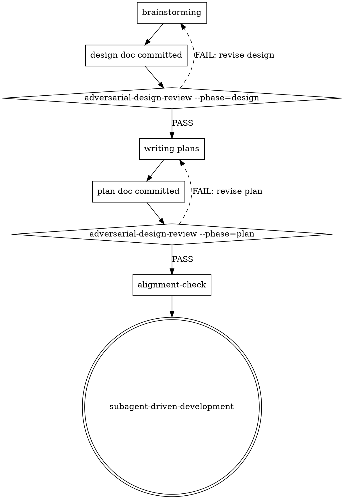

# Adversarial Design / Plan Review

## Overview

Every other review gate in this plugin attacks **code**. `alignment-check` attacks
**structure** (forward + reverse trace). Nothing attacks the **ideas** in the
design or plan themselves. This skill closes that gap.

The cheapest place to kill a bad idea is **before** the plan is written. The
second-cheapest is before code is written. After that, costs rise sharply. This
skill runs adversarially at both points.

**Core principle:** a design or plan is a hypothesis. Treat it like a PR diff
that hasn't been reviewed yet. Find what's wrong with it on purpose.

## When to Use

Two phases, two invocations:

- **`--phase=design`** — invoked by `brainstorming` after the design doc is
  written and committed, **before** transitioning to `writing-plans`.
- **`--phase=plan`** — invoked by `writing-plans` after the plan doc is
  written and committed, **before** `alignment-check`.

Manual invocation is also supported on any committed design or plan in
`docs/plans/`.



## Adversarial Framing (mandatory)

The reviewer's prompt MUST use adversarial framing — not validation framing.
Same discipline as `skills/requesting-code-review/SKILL.md`, applied to design
artifacts.

**Required prompt phrasing in every dispatch:**

> Find at least three things wrong with this design (or plan), even if they
> seem minor — or, if fewer than three are found, explicitly document every
> bug-class check you ran and what you found (or didn't). Bias toward finding
> issues. You are NOT validating that the artifact is good — you are looking
> for misconceptions, unstated assumptions, and ideas the author didn't
> consider. Reflexive approval is forbidden.

**Forbidden phrasing:** "review the design", "verify the plan looks good",
"confirm correctness", any wording that implies the reviewer's job is to
sign off. These produce theatre.

The reviewer is not a yes-person. The reviewer is a skeptic whose job is to
make the design or plan stronger by attacking it.

## Bug-class checklist — design phase (must scan)

The reviewer MUST explicitly scan and report findings for each class. The
checklist is the floor, not the ceiling. Additional findings are welcome.

| Class | Definition |
|---|---|
| **Unstated assumptions** | Load-bearing claims that aren't written down. "We assume the upstream API is idempotent." "We assume single-tenant." "We assume the user has admin." List them. Flag any where, if the assumption is wrong, the design collapses. |
| **Repo-precedent conflicts** | Does this design fight existing patterns, skills, or conventions in this repo? Cite the conflicting `path/file.md:line`. If the design proposes a new pattern that contradicts an established one, the design must justify the divergence. |
| **YAGNI violations** | Features in the design that aren't justified by stated requirements. Configuration knobs nobody asked for. Generality nobody needs. Future-proofing for cases that may never arrive. |
| **Missing failure modes** | What fails first under partial failure, network partition, restart-mid-operation, malformed input, adversarial input, the dependency being down? If the design doesn't address it, flag it. |
| **Security / privacy at architecture level** | Auth boundaries, secret flow, blast radius on compromise, PII exposure, log leakage, CSRF/SSRF/auth-confused-deputy at the design level (not at the code level — that's `requesting-code-review`'s job). |
| **Rollback story** | How do we undo this if it goes wrong in production? For any change class that runtime-launch-validation already triggers on (build/deployment/version pins/startup config/migrations/plugin loading), the design MUST specify a rollback path. If absent → finding. |
| **Simpler alternative not considered** | Name the laziest plausible solution. Did the design consider it and reject it for stated reasons? If not → finding. "Couldn't this be a flat file?" "Couldn't this be a cron job?" "Couldn't this be a single SQL view?" |
| **User-intent drift** | Re-read the original ask. Does the design solve what the user asked for, or does it solve a different problem that was easier to design for? Compare the design's stated goals against the user's stated goals; flag drift. |

## Bug-class checklist — plan phase (must scan)

The plan-phase reviewer scans the design-phase classes above (since the plan
inherits the design's blast radius) and adds:

| Class | Definition |
|---|---|
| **Over-decomposition / under-decomposition** | Does task granularity match `writing-plans`'s 2–5-minute target per step? A 40-step plan for a CSV export is suspect. A 2-step plan for a schema migration is suspect. Flag both directions. |
| **Verification-class mismatch** | For each task, does its verification step match its change class per the table in `skills/writing-plans/SKILL.md` ("Verification per change class")? A schema migration verified by unit tests = finding. An API endpoint with no curl invocation = finding. |
| **Hidden serial dependencies** | Tasks the plan claims are independent but actually share state (same file, same DB row, same config key). If executed in parallel, they'll collide. Flag any such pair. |
| **Missing rollback wiring** | The design specifies a rollback story (per the design-phase class above). Is it actually implemented in the plan as a task or step? Or is it a paragraph nobody is going to write code for? |

## Process

1. **Read the artifact under review.** For `--phase=design`, read the design
   doc at `docs/plans/YYYY-MM-DD-<topic>-design.md`. For `--phase=plan`, read
   both the design doc AND the plan doc at
   `docs/plans/YYYY-MM-DD-<feature>.md` — the plan inherits the design's
   premises and you must attack both layers.
2. **Read the original user ask.** Where available (transcript, issue body,
   PR description). User-intent drift can't be caught without it.
3. **Spot-check the repo for precedent conflicts.** Grep for related
   skills, similar designs in `docs/plans/`, established patterns. Cite
   what you find.
4. **Run every bug-class check** in the relevant checklist. For each class,
   record one of:
   - **Finding** with file/section + severity (Critical / Important / Minor)
   - **Clean** with a one-sentence note on what you specifically checked
5. **Surface options, not just objections.** For findings, propose a
   concrete fix or alternative. "This design assumes X" → "Alternative: state
   X explicitly, and add a fallback if X is false at runtime."
6. **Write the report.** Format below. Commit verdict: PASS / FAIL.

## Report format

````markdown
### Adversarial Review Report

**Phase:** design | plan
**Artifact:** docs/plans/YYYY-MM-DD-<file>.md
**Status:** PASS | FAIL

**Findings (Critical):**
- [class] [section/line]: <description>. Recommendation: <concrete fix>.

**Findings (Important):**
- [class] [section/line]: <description>. Recommendation: <concrete fix>.

**Findings (Minor):**
- [class] [section/line]: <description>. Recommendation: <concrete fix>.

**Bug-class scan transcript:**
| Class | Result | Note |
|---|---|---|
| Unstated assumptions | Finding / Clean | <one sentence> |
| Repo-precedent conflicts | Finding / Clean | <one sentence> |
| ... | ... | ... |

**Options the author may not have considered:**
1. <alternative approach>: <one paragraph trade-off>
2. <alternative approach>: <one paragraph trade-off>

**Verdict reasoning:** <one paragraph>
````

A bare "looks good" verdict is rejected. The bug-class scan transcript MUST
list every class with a result, even if the result is Clean.

## PASS / FAIL semantics

- **PASS** — no Critical findings; Important findings either resolved or
  explicitly accepted by the author with reasoning.
- **FAIL** — one or more Critical findings, OR Important findings the
  author has not addressed.

On FAIL:

- Feed findings back to the upstream skill (`brainstorming` for design
  phase, `writing-plans` for plan phase).
- The upstream skill revises the artifact based on Critical and Important
  findings, then re-invokes adversarial review.
- **Max 2 revision cycles** before escalating to the user with a summary of
  unresolved findings. This mirrors the bound in
  `skills/alignment-check/SKILL.md`.
- The user may **override** a finding (mark it accepted with reasoning).
  Overrides are recorded in the artifact (e.g., "Reviewer flagged X as
  YAGNI; accepted because Y") so the decision is durable.

On PASS:

- For `--phase=design`: invoke `writing-plans`.
- For `--phase=plan`: invoke `alignment-check` (which is now narrowly
  structural — adversarial concerns are already cleared).

## Dispatching the reviewer agent

Dispatch a `balanced`-tier subagent. Same tier as `alignment-check` and
`requesting-code-review` reviewers — this is review-class work, not
orchestration.

<host: claude-code>
Use the Agent tool to dispatch:

````
Agent tool (general-purpose, model: balanced):
  description: "Adversarial review: <design|plan>"
  prompt: |
    You are adversarially reviewing a software <design|plan> document.

    Read these files:
    - <design-doc-path>
    - <plan-doc-path>  (only for --phase=plan)
    - The original user ask (paste it inline below).

    USER ASK (verbatim):
    <paste the user's original ask here>

    ## Required framing
    Find at least three things wrong with this <design|plan>, even if they
    seem minor — or, if fewer than three are found, explicitly document
    every bug-class check you ran and what you found (or didn't). Bias
    toward finding issues. You are NOT validating that the artifact is
    good — you are looking for misconceptions, unstated assumptions, and
    ideas the author didn't consider. Reflexive approval is forbidden.

    ## Required scans
    Scan every bug class listed in the relevant checklist (paste the
    checklist for the chosen phase verbatim into the dispatch prompt — do
    not make the subagent read this skill file; embed the table inline).

    ## Required output
    Use the Report format from the skill. Every bug class must appear in
    the scan transcript with a result (Finding or Clean) and a one-sentence
    note. Findings must include severity, file/section reference, and a
    concrete recommendation.

    Set Status to PASS only if there are zero Critical findings AND every
    Important finding either has a fix recommendation accepted by the
    author or is escalated as an open question. Otherwise FAIL.
````
</host>

<host: codex, opencode, cursor>
Run the adversarial review inline: read the design (and plan, if
`--phase=plan`), perform every bug-class scan in the checklist, and produce
the Report format above. The framing requirements still apply — adversarial
mindset, ≥3 findings or full transcript, no reflexive approval.
</host>

## Integration

**Called by:**
- `brainstorming` — `--phase=design`, after design doc is committed.
- `writing-plans` — `--phase=plan`, after plan doc is committed, before
  `alignment-check`.
- Manual — user invokes against any artifact in `docs/plans/`.

**Calls:**
- `brainstorming` — on FAIL during `--phase=design`, for revision.
- `writing-plans` — on FAIL during `--phase=plan`, for revision.
- `writing-plans` — on PASS during `--phase=design`.
- `alignment-check` — on PASS during `--phase=plan`.

## Why two phases, not one

Different bug classes live in different artifacts:

- The **design** is the place to ask "is this the right idea?". Catching a
  YAGNI violation here saves N tasks of plan-writing and N×M lines of
  implementation.
- The **plan** is the place to ask "is the breakdown sound?". Verification-
  class mismatches and hidden serial dependencies don't show up in the
  design — only in the plan.

Folding them into one pass at one stage misses half the findings.

## Why "options the author may not have considered" is mandatory

A reviewer that only objects produces a frustrated author. A reviewer that
**also** offers concrete alternatives produces a stronger artifact. The
"Options" section of the report is non-negotiable: every report must include
at least one alternative the author may not have weighed, even if the
verdict is PASS. This is the antidote to reflexive sign-off and the
antidote to demoralizing critique.

## Relationship to other review skills

| Skill | Attacks | When |
|---|---|---|
| `adversarial-design-review --phase=design` | Ideas in the design | After brainstorming |
| `adversarial-design-review --phase=plan` | Ideas in the plan | After writing-plans |
| `alignment-check` | Structural coverage (design ↔ plan trace) | After plan-phase adversarial review |
| `requesting-code-review` | Code (scope + bug classes) | After each task's commit |
| `verification-before-completion` | Claims (evidence before assertions) | Before claiming done |

Each gate has a distinct target. Stacking them does not produce duplicate
findings — they catch different bug classes at different stages.
