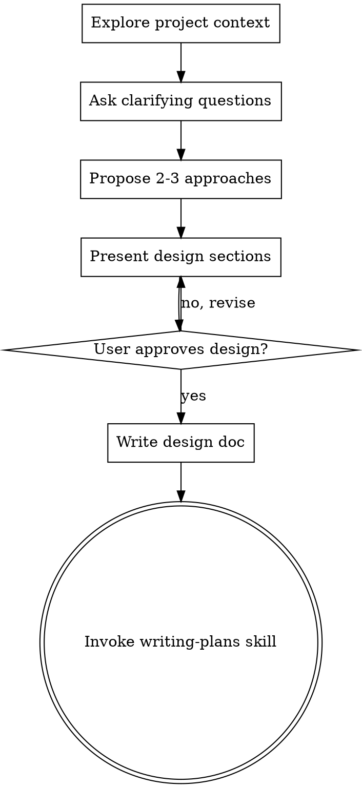

# Brainstorming Ideas Into Designs

## Overview

Help turn ideas into fully formed designs and specs through natural collaborative dialogue.

Start by understanding the current project context, then ask questions one at a time to refine the idea. Once you understand what you're building, present the design and get user approval.

<HARD-GATE>
Do NOT invoke any implementation skill, write any code, scaffold any project, or take any implementation action until you have presented a design and the user has approved it. This applies to EVERY project regardless of perceived simplicity.
</HARD-GATE>

## Anti-Pattern: "This Is Too Simple To Need A Design"

Every project goes through this process. A todo list, a single-function utility, a config change — all of them. "Simple" projects are where unexamined assumptions cause the most wasted work. The design can be short (a few sentences for truly simple projects), but you MUST present it and get approval.

## Checklist

You MUST create a task for each of these items and complete them in order:

1. **Explore project context** — check files, docs, recent commits
2. **Ask clarifying questions** — adaptive batching: group related questions to reduce round-trips; use targeted singles for follow-ups
3. **Propose 2-3 approaches** — with trade-offs and your recommendation
4. **Present design** — in sections scaled to their complexity, get user approval after each section
5. **Write design doc** — save to `docs/plans/YYYY-MM-DD-<topic>-design.md` and commit
6. **Transition to implementation** — invoke writing-plans skill to create implementation plan

## Process Flow

**The terminal state is invoking writing-plans.** Do NOT invoke frontend-design, mcp-builder, or any other implementation skill. The ONLY skill you invoke after brainstorming is writing-plans.

## The Process

**Understanding the idea:**
- Check out the current project state first (files, docs, recent commits)
- Ask questions using adaptive batching — group related questions to reduce round-trips:
  - **First batch:** covers purpose, constraints, scope, and tech choices
  - **Follow-ups:** Targeted single questions based on interesting or ambiguous answers

  <host: claude-code>
  - Use multiple choice options when possible (AskUserQuestion supports 2-4 options per question)
  - AskUserQuestion supports up to 4 questions per form — use this to reduce round-trips
  </host>

  <host: codex, opencode, cursor>
  - Present options as a numbered list and ask the user to reply with the chosen number
  - Group no more than 3 questions per turn to avoid overloading the chat
  </host>

- Focus on understanding: purpose, constraints, success criteria

**Exploring approaches:**
- Propose 2-3 different approaches with trade-offs
- Present options conversationally with your recommendation and reasoning
- Lead with your recommended option and explain why

**Presenting the design:**
- Once you believe you understand what you're building, present the design
- Scale each section to its complexity: a few sentences if straightforward, up to 200-300 words if nuanced
- Ask after each section whether it looks right so far
- Cover: architecture, components, data flow, error handling, testing
- Be ready to go back and clarify if something doesn't make sense

## Design-only mode

When the user wants design exploration without execution, they pass `--design-only` to brainstorming.

**Behavior under `--design-only`:**

1. Run the full brainstorming flow (explore context → questions → approaches → design → write design doc → commit).
2. When invoking writing-plans, propagate the `--design-only` flag.
3. writing-plans honors the flag: alignment-check PASS → STOP (no execution dispatched). On alignment FAIL, writing-plans revises and re-checks per its normal FAIL handling, then stops — still no execution dispatched. On persistent FAIL (after max 2 revision cycles), escalates to user with unresolved drift summary — no execution dispatched regardless.
4. The pipeline ends with a committed design doc + plan in `docs/plans/`.

**Default (no flag):** brainstorming → writing-plans → alignment-check → subagent-driven-development → … (autonomous handoff to execution).

## After the Design

**Documentation:**
- Write the validated design to `docs/plans/YYYY-MM-DD-<topic>-design.md`
- Use elements-of-style:writing-clearly-and-concisely skill if available
- Commit the design document to git

**Autonomous handoff:**
- This is the user's **last interaction point** — everything after runs autonomously
- Invoke the writing-plans skill with autonomous context: the design is approved, no further user input needed
- The writing-plans skill will prefer Claude's Plan Mode if available (Claude Code), falling back to its built-in planning process in other environments
- The pipeline from here: writing-plans → alignment-check → team execution → PR creation → PR monitoring
- Do NOT invoke any other skill. writing-plans is the next step. It handles the rest of the autonomous pipeline.

## Key Principles

- **Adaptive question batching** - Group related questions to reduce round-trips; use targeted singles for follow-ups
- **Multiple choice preferred** - Easier to answer than open-ended when possible
- **YAGNI ruthlessly** - Remove unnecessary features from all designs
- **Explore alternatives** - Always propose 2-3 approaches before settling
- **Incremental validation** - Present design, get approval before moving on
- **Be flexible** - Go back and clarify when something doesn't make sense
- **Design approval = autonomy handoff** - After design approval, the pipeline runs without user input
