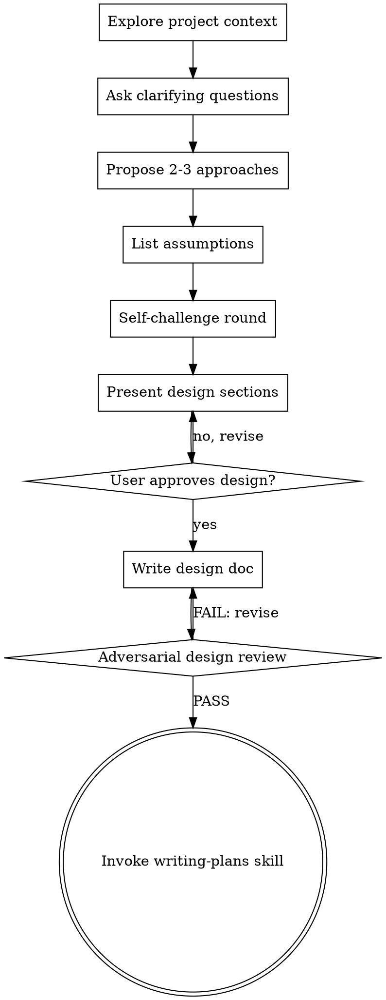

# Brainstorming Ideas Into Designs

## Overview

Help turn ideas into fully formed designs and specs through natural collaborative dialogue.

Start by understanding the current project context, then ask questions using adaptive batching to refine the idea. Once you understand what you're building, present the design and get user approval.

<HARD-GATE>
Do NOT invoke any implementation skill, write any code, scaffold any project, or take any implementation action until you have presented a design and the user has approved it. This applies to EVERY project regardless of perceived simplicity.
</HARD-GATE>

## Anti-Pattern: "This Is Too Simple To Need A Design"

Every project goes through this process. A todo list, a single-function utility, a config change — all of them. "Simple" projects are where unexamined assumptions cause the most wasted work. The design can be short (a few sentences for truly simple projects), but you MUST present it and get approval.

## Checklist

You MUST create a task for each of these items and complete them in order:

1. **Explore project context** — check files, docs, recent commits
2. **Ask clarifying questions** — adaptive batching: group related questions to reduce round-trips; use targeted singles for follow-ups
3. **Propose 2-3 approaches** — with trade-offs and your recommendation
4. **List load-bearing assumptions explicitly** — every design rests on assumptions ("upstream API is idempotent", "single-tenant", "user has admin"); write them down so the adversarial reviewer can attack them
5. **Self-challenge round** — before presenting to the user, role-play a skeptic against your own design and surface the top 3 doubts (see "Self-challenge round" below). Cleans up obvious issues before the user sees the design.
6. **Present design** — in sections scaled to their complexity, get user approval after each section. Include the assumption list and the top doubts surfaced by the self-challenge so the user sees them.
7. **Write design doc** — save to `docs/plans/YYYY-MM-DD-<topic>-design.md` and commit. The doc MUST include an `## Assumptions` section and a `## Rollback` section for change classes that affect runtime (build, deployment, version pins, startup config, migrations, plugin loading paths) — same trigger list as `runtime-launch-validation`.
8. **Adversarial design review** — invoke `adversarial-design-review --phase=design`. On FAIL, revise per findings and re-run (max 2 cycles). On PASS, proceed.
9. **Transition to implementation** — invoke writing-plans skill to create implementation plan

## Process Flow

**The terminal state is invoking writing-plans** (after adversarial review passes). Do NOT invoke frontend-design, mcp-builder, or any other implementation skill. The ONLY skill you invoke after brainstorming is `adversarial-design-review` and then `writing-plans`.

## The Process

**Understanding the idea:**
- Check out the current project state first (files, docs, recent commits)
- Ask questions using adaptive batching — group related questions to reduce round-trips:
  - **First batch:** covers purpose, constraints, scope, and tech choices
  - **Follow-ups:** Targeted single questions based on interesting or ambiguous answers

  <host: claude-code>
  - Use multiple choice options when possible (AskUserQuestion supports 2-4 options per question)
  - AskUserQuestion supports up to 4 questions per form — use this to reduce round-trips
  </host>

  <host: codex, opencode, cursor>
  - Present options as a numbered list and ask the user to reply with the chosen number
  - Group no more than 3 questions per turn to avoid overloading the chat
  </host>

- Focus on understanding: purpose, constraints, success criteria

**Exploring approaches:**
- Propose 2-3 different approaches with trade-offs
- Present options conversationally with your recommendation and reasoning
- Lead with your recommended option and explain why

**Presenting the design:**
- Once you believe you understand what you're building, present the design
- Scale each section to its complexity: a few sentences if straightforward, up to 200-300 words if nuanced
- Ask after each section whether it looks right so far
- Cover: architecture, components, data flow, error handling, testing, **assumptions** (load-bearing claims), **rollback** (for runtime-affecting change classes)
- Include the top 3 doubts surfaced by the self-challenge round so the user can react before approving
- Be ready to go back and clarify if something doesn't make sense

## Self-challenge round

Before presenting the design to the user, role-play a skeptic against your own design for one short pass. The goal is to clean up the obvious issues *before* the user sees them and *before* the heavyweight `adversarial-design-review` runs.

Ask yourself, in order, and keep notes:

1. **What's the laziest plausible solution to the user's actual ask?** Could a flat file, a cron job, or a single SQL view do it? If yes, why does the design pick something heavier?
2. **Which of my listed assumptions, if false, would break this design?** Pick the most fragile one.
3. **What does this design solve that the user did NOT ask for?** YAGNI sweep — list any feature, knob, or generality that isn't traceable to the user's stated goals.
4. **What fails first under partial failure / restart-mid-operation / malformed input?** Pick one and decide whether the design addresses it.
5. **Does this design fight any existing pattern in the repo?** If yes, name the conflicting `path/file.md`.

If any answer surfaces a real issue, revise the design before presenting it. Otherwise, surface the top 3 doubts to the user when you present (so they can decide whether the trade-offs are acceptable). This is a 30-second exercise, not a debate.

This is intentionally lightweight; the heavyweight pass is `adversarial-design-review`, which runs after the design is committed.

## Design-only mode

When the user wants design exploration without execution, they pass `--design-only` to brainstorming.

**Behavior under `--design-only`:**

1. Run the full brainstorming flow (explore context → questions → approaches → assumptions → self-challenge → design → write design doc → commit).
2. Invoke `adversarial-design-review --phase=design`. On FAIL, revise the design and re-run (max 2 cycles). On persistent FAIL, escalate to user with unresolved findings — no plan dispatched.
3. On PASS, invoke writing-plans, propagating the `--design-only` flag.
4. writing-plans honors the flag: adversarial-design-review (plan phase) PASS → alignment-check PASS → STOP (no execution dispatched). On FAIL at any gate, writing-plans revises and re-checks per its normal FAIL handling, then stops — still no execution dispatched. On persistent FAIL (after max 2 revision cycles per gate), escalates to user — no execution dispatched regardless.
5. The pipeline ends with a committed design doc + plan in `docs/plans/` plus the adversarial review reports.

**Default (no flag):** brainstorming → adversarial-design-review (design) → writing-plans → adversarial-design-review (plan) → alignment-check → subagent-driven-development → … (autonomous handoff to execution).

## After the Design

**Documentation:**
- Write the validated design to `docs/plans/YYYY-MM-DD-<topic>-design.md`
- Include explicit `## Assumptions` and `## Rollback` sections (the latter only required for change classes that affect runtime — see the trigger list in `runtime-launch-validation` / `finishing-a-development-branch` Step 1b)
- Use elements-of-style:writing-clearly-and-concisely skill if available
- Commit the design document to git

**Adversarial review (mandatory):**
- Invoke `adversarial-design-review --phase=design` against the committed design
- On PASS, proceed to autonomous handoff
- On FAIL, revise the design based on Critical and Important findings and re-run (max 2 cycles before escalating to the user with unresolved findings)
- The user may override a finding (mark it accepted with reasoning recorded in the design doc)

**Autonomous handoff:**
- This is the user's **last interaction point** — everything after runs autonomously
- Invoke the writing-plans skill with autonomous context: the design is approved AND adversarially reviewed, no further user input needed
- The writing-plans skill will prefer Claude's Plan Mode if available (Claude Code), falling back to its built-in planning process in other environments
- The pipeline from here: writing-plans → adversarial-design-review (plan phase) → alignment-check → team execution → PR creation → PR monitoring
- Do NOT invoke any other skill. `adversarial-design-review` runs first; on PASS, writing-plans is the next step. It handles the rest of the autonomous pipeline.

## Key Principles

- **Adaptive question batching** - Group related questions to reduce round-trips; use targeted singles for follow-ups
- **Multiple choice preferred** - Easier to answer than open-ended when possible
- **YAGNI ruthlessly** - Remove unnecessary features from all designs
- **Explore alternatives** - Always propose 2-3 approaches before settling
- **Make assumptions explicit** - Load-bearing assumptions belong in writing, not in the agent's head
- **Self-challenge before presenting** - Cleans up obvious issues; saves the user a round-trip
- **Adversarial review before execution** - The cheapest place to kill a bad idea is before the plan is written
- **Incremental validation** - Present design, get approval before moving on
- **Be flexible** - Go back and clarify when something doesn't make sense
- **Design approval = autonomy handoff** - After design approval AND adversarial review pass, the pipeline runs without user input
