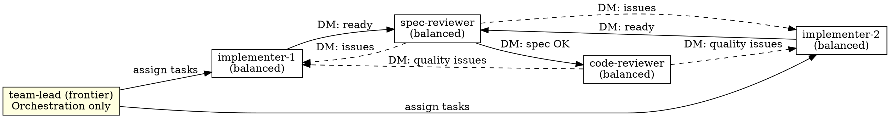

# Subagent-Driven Development

Execute a plan using either a role-based subagent team or sequential subagents, with two-stage review: spec compliance first, then code quality.

**Core principle:** Structured roles + two-stage review (spec then quality) = high-quality, parallel execution.

## Execution Mode

<host: claude-code>

**Default: Agent Teams** — when the TeamCreate tool is available and
`CLAUDE_CODE_EXPERIMENTAL_AGENT_TEAMS` is set, use persistent parallel agents with a shared
task list. Each agent claims work independently; the team-lead orchestrates only.

**Fallback: Sequential Subagents** — when Agent Teams is not available, dispatch one subagent
per task. See the [Sequential Mode](#sequential-mode) section below.

```
# Runtime check
# If TeamCreate tool exists in your tool list → use Agent Teams
# Otherwise → use Sequential Mode
```

</host>

<host: codex>

**Sequential Subagents** — Codex does not provide a shared task list or persistent team
chat. Spawn one subagent per task using Codex's native subagent tool, passing the full plan
task text in the prompt. Use git branch names and PR diffs as the coordination surface
instead of a task queue. See [Sequential Mode](#sequential-mode).

</host>

---

<host: claude-code>

## Agent Teams Mode

### Team Structure



### Team Sizing

| Plan Tasks | Implementers |
|-----------|-------------|
| 1-5       | 1           |
| 6-15      | 2           |
| 16+       | 3           |

### Step-by-Step Process

**1. Read plan and create team:**

```
TeamCreate({ team_name: "<project-name>", description: "<goal>" })
```

Read the plan file, extract all tasks with full text.

**2. Create tasks in shared task list:**

For each plan task, create a TaskCreate with:
- `subject`: "Implement: <task name>"
- `description`: Full task text from plan + design doc reference + context
- `activeForm`: "Implementing <task name>"

Then create corresponding review tasks:
- "Review spec: <task name>" (blockedBy: implement task)
- "Review quality: <task name>" (blockedBy: spec review task)

**3. Spawn teammates:**

Spawn each teammate with the Agent tool using `team_name` and `name` parameters:

**Implementers** (use `./implementer-prompt.md` as base):
```
Agent tool:
  team_name: "<project-name>"
  name: "implementer-1"
  subagent_type: "general-purpose"
  model: "balanced"
  prompt: |
    You are implementer-1 on team <project-name>.

    ## Your Role
    Claim implementation tasks from the task list, implement them using TDD,
    commit your work, then DM spec-reviewer when ready for review.

    ## Workflow
    1. Check TaskList for available unblocked tasks with "Implement:" prefix
    2. Claim one with TaskUpdate (set owner to your name, status to in_progress)
    3. Implement the task following TDD (see task description for full spec)
    4. Self-review per `agents/team-conventions.md`
    5. Commit your work
    6. DM spec-reviewer: "Task N ready for review" with summary of what you built
    7. Wait for reviewer feedback — fix issues if any
    8. After code-reviewer approves, check TaskList for next task
    9. When no tasks remain, report to team-lead

    ## Design Document
    Reference: <design-doc-path>

    ## Team Conventions
    Follow `agents/team-conventions.md` for all implementer discipline rules.
    For version-skew audit requirements, also follow
    `skills/finishing-a-development-branch/SKILL.md` Step 1c.

    ## Important
    - Work in the project directory: <working-dir>
    - Use `isolation: "worktree"` is NOT needed — you're already in an isolated context
    - Always commit your work before requesting review
    - If you have questions, DM the team-lead — don't guess
```

**Spec Reviewer** (use `./spec-reviewer-prompt.md` as base):
```
Agent tool:
  team_name: "<project-name>"
  name: "spec-reviewer"
  subagent_type: "general-purpose"
  model: "balanced"
  prompt: |
    You are spec-reviewer on team <project-name>.

    ## Your Role
    When implementers DM you that a task is ready, verify the implementation
    matches the spec exactly — nothing missing, nothing extra.

    ## Workflow
    1. Wait for DMs from implementers
    2. When you receive "Task N ready for review":
       a. Read the task description from TaskGet
       b. Read the actual code the implementer wrote
       c. Compare implementation to spec line by line
       d. Check: missing requirements? Extra features? Misunderstandings?
    3. If issues found:
       - DM implementer with specific issues (file:line references)
       - Wait for them to fix and re-notify you
       - Re-review
    4. If spec compliant:
       - DM code-reviewer: "Task N spec-approved, ready for quality review"
       - Mark the "Review spec:" task as completed via TaskUpdate

    ## Design Document
    Reference: <design-doc-path>

    ## Team Conventions
    See `agents/team-conventions.md` for scope-vs-dispatch compliance gate
    and review discipline every spec-reviewer applies.
```

**Code Reviewer** (use `./code-quality-reviewer-prompt.md` as base):
```
Agent tool:
  team_name: "<project-name>"
  name: "code-reviewer"
  subagent_type: "general-purpose"
  model: "balanced"
  prompt: |
    You are code-reviewer on team <project-name>.

    ## Your Role
    When spec-reviewer DMs you that a task is spec-approved, review code quality.

    ## Workflow
    1. Wait for DMs from spec-reviewer
    2. When you receive "Task N spec-approved":
       a. Read the implementation code
       b. Review: naming, structure, tests, error handling, patterns
       c. Categorize issues: Critical / Important / Minor
    3. If Critical or Important issues:
       - DM the implementer who built it with specific issues
       - Wait for fix and re-review
    4. If approved:
       - Mark BOTH tasks completed via TaskUpdate: the "Review quality:" task AND the corresponding "Implement:" task. Code-reviewer is the only role that flips the Implement task to completed; missing this leaves the orchestrator with bookkeeping stragglers.
       - DM team-lead: "Task N fully approved"

    ## Team Conventions
    See `agents/team-conventions.md` for adversarial framing and the
    per-finding inline output format. For the bug-class checklist and
    verdict vocabulary, see `skills/requesting-code-review/SKILL.md`.
```

**4. Monitor and steer:**

As team-lead, your job is now orchestration:
- Monitor task completions via TaskList
- Reassign work if an implementer is stuck (DM them)
- Answer implementer questions (they'll DM you)
- Track overall progress
- When all tasks complete → proceed to finishing

**5. Shutdown and finish:**

When all tasks are complete:
```
SendMessage({ type: "shutdown_request", recipient: "implementer-1", content: "All tasks done" })
SendMessage({ type: "shutdown_request", recipient: "implementer-2", content: "All tasks done" })
SendMessage({ type: "shutdown_request", recipient: "spec-reviewer", content: "All tasks done" })
SendMessage({ type: "shutdown_request", recipient: "code-reviewer", content: "All tasks done" })
```

Wait for all shutdown approvals, then:
```
TeamDelete()
```

Invoke `superpowers:finishing-a-development-branch`.

</host>

<host: codex, opencode, cursor>

Use Sequential Mode — see the [Sequential Mode](#sequential-mode) section below.

</host>

---

## Sequential Mode

Use when Agent Teams is not available, or on any host that does not provide persistent
parallel agents. One subagent handles one task at a time; reviews happen between tasks.

### Process

For each task in the plan:

1. **Dispatch implementer subagent** — provide the full task text, the design doc path, and
   the working directory in the prompt. Use `./implementer-prompt.md` as the base template.
2. **Answer questions** if the implementer surfaces blockers.
3. Implementer implements, tests, commits, and self-reviews per `agents/team-conventions.md`.
4. **Dispatch spec reviewer** — provide the task text and the implementer's commit SHA.
   Use `./spec-reviewer-prompt.md` as the base template.
5. If spec issues found → implementer fixes → re-review until spec-approved.
6. **Dispatch code quality reviewer** — use `./code-quality-reviewer-prompt.md`.
7. If quality issues found → implementer fixes → re-review until approved.
8. Mark task complete and move to the next.

After all tasks: invoke `superpowers:finishing-a-development-branch`.

<host: codex>

### Codex Coordination Notes

Codex subagents do not share a task list. Use these conventions instead:

- **Task identity**: pass `task_id: N` and the full task text in the prompt so each subagent
  knows exactly what it owns. Do not rely on a shared queue.
- **Handoff surface**: use git branch names (`task-N-<slug>`) and PR diffs as the review
  surface. The spec-reviewer and code-reviewer read the PR diff, not a task record.
- **Progress tracking**: after each task completes, record completion in the orchestrating
  agent's own context (e.g., a local list) rather than a shared task table.
- **No DM channel**: pass reviewer output back to the orchestrator as a return value; the
  orchestrator decides whether to re-dispatch the implementer.

</host>

---

## Red Flags

**Never:**
- Start implementation on main/master without explicit user consent
- Skip reviews (spec compliance OR code quality)
- Proceed with unfixed issues
- Make subagents/teammates read plan files — provide full text in the prompt instead
- Skip scene-setting context in any subagent prompt
- Start code quality review before spec compliance passes
- Move to next task while either review has open issues

<host: claude-code>
- In Agent Teams mode: let the team-lead implement (orchestration only)
</host>

**If reviewer finds issues:**
- Implementer fixes them
- Reviewer reviews again
- Repeat until approved
- Don't skip the re-review

---

## Integration

**Required workflow skills:**
- **superpowers:using-git-worktrees** - REQUIRED: Set up isolated workspace before starting
- **superpowers:writing-plans** - Creates the plan this skill executes
- **superpowers:alignment-check** - Verifies plan matches design (autonomous mode)
- **superpowers:finishing-a-development-branch** - Complete development after all tasks

**Subagents/teammates should use:**
- **superpowers:test-driven-development** - Follow TDD for each task

**Alternative workflow:**
- **superpowers:executing-plans** - Use for parallel session instead of same-session execution

---

## Resilience: compaction recovery, watchdog cadence, and quality rotation

Long autonomous runs degrade silently. Three failure modes are common enough to be designed for: a session compacts mid-pipeline and you forget what you were doing; a background subagent zombies / rate-limits / drifts off-task while you wait; one specific subagent_type is consistently low-quality but you keep re-prompting it. Apply the patterns below whenever you have subagents in flight.

### 1. Compaction recovery

Both lead-orchestrator and subagent sessions can compact during a long run. After any compaction or resume, before answering the next message, **re-orient first**:

- Re-acknowledge the original task in your next reply ("Resuming: I was on step N of plan X").
- Re-read the plan or design doc if it isn't fresh in your active context.
- Re-check the status of any dispatched subagents before issuing new instructions.

How the re-orientation context arrives depends on the host:

<host: claude-code, cursor>

Hooks automate it. The plugin's `SessionStart` hook (matcher `compact|resume`) fires inside the compacted session and injects a `<superpowers-resumption-context>` block containing:

- The first user message from the transcript (the "original task") — this is what re-anchors a compacted **subagent** to its assignment.
- Recent superpowers activity (last 30 entries from `.claude/superpowers-state/in-progress.jsonl`) — this is what re-anchors the **lead** in the pipeline.

Activity is captured by a `PostToolUse` hook (matcher `Skill|Agent|Task.*`) that appends each invocation to the JSONL state file (capped at 200 lines; wiped on `startup|clear` or when the session source can't be determined). The state file is project-local at `.claude/superpowers-state/in-progress.jsonl`.

You don't opt in. When you see the resumption block, treat it as authoritative and reorient before responding.

</host>

<host: codex, opencode>

Hooks are not documented on this host. Apply the pattern manually: at the start of every reply that follows a context compaction, scroll back to the first user message in your visible transcript, re-state the task to yourself, then proceed. If you keep a running activity log in your scratch context, re-read it before issuing new subagent instructions.

</host>

### 2. Watchdog cadence (every 5–10 minutes)

When you have one or more subagents running in the background, check on them on a 5–10 minute cadence. Don't fire-and-forget.

**On each check, verify:**
- Still running? A hung/zombied agent might not have produced any signal — explicit status confirms it's still active.
- Producing output? An agent that has stopped emitting tool calls or text for >5 minutes is suspect.
- Errored? Look for API errors, rate limits, transport failures, "context length exceeded" — these often surface as a stalled output stream rather than a crash.
- Off-track? Spot-check that the latest output is actually progressing the assigned task, not flailing on a tangent.

**If a subagent looks stuck:**
- Send a corrective message to redirect (e.g. "you have been silent for 7 minutes; report current state and the next concrete step you will take").
- If unrecoverable: terminate it, then re-dispatch a fresh subagent with the same brief plus a one-line note about what the prior attempt got wrong.

<host: claude-code>

Use `TaskList` to confirm active subagents, `TaskOutput` to read recent stdout, `SendMessage` (with `to: <agent-id-or-name>`) to send corrective input, and `TaskStop` to terminate. When using `ScheduleWakeup` to pace a `/loop` self-paced run, factor watchdog checks into the cadence — don't sleep past your next check window.

</host>

<host: codex>

Codex doesn't expose a structured task list. Track dispatched subagents in your own scratch context (one line per subagent: id, started-at, last-checked-at, current-stage). On each watchdog interval, ask each subagent for a status report directly via its thread; "report your current step and what you plan to do next, in one paragraph" forces it to surface progress or admit it's stuck.

</host>

<host: opencode>

Use `@mention` to peer sessions to ping each background subagent for a status report on cadence. If a peer has gone silent past the check window, treat it as suspect.

</host>

### 3. Quality-based rotation (replace consistently-failing teammates)

Subagents are teammates, not infrastructure. If one keeps producing low-quality output, replace it instead of re-prompting forever.

**Track per subagent_type, per session:**
- Number of code-review rejections it produced (spec compliance OR code quality stage).
- Number of times you had to send corrective input to redirect it.
- Number of test/build failures attributable to its work.

**Rotation triggers:**
- 2 consecutive code-review rejections on the same task → switch to a different `subagent_type` for the retry, or escalate to a higher model tier (see `agents/model-tiers.md` for the role-to-host model mapping).
- 3 cumulative quality issues across tasks in one session → stop dispatching that subagent_type for the remainder of the session; re-route its work to an alternative.
- A subagent that ignores explicit guidance twice in a row → stop using it; the issue is the agent profile, not the prompt.

When you rotate, briefly state the rotation in user-facing text ("Rotating off `general-purpose` for review tasks — two consecutive rejections; using `superpowers:code-reviewer` instead") so the user has a chance to redirect.

### Why these patterns

The hook automation handles compaction recovery deterministically on hosts that support it. The watchdog cadence and rotation rules rely on you applying them consistently — without them, a subagent that compacts, hits a transient API error, or quietly drifts off-task can burn 30+ minutes before anyone notices.
