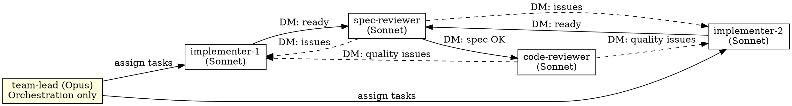

# Subagent-Driven Development

Execute plan using Agent Teams (default) or sequential subagents (fallback), with two-stage review: spec compliance first, then code quality.

**Core principle:** Role-based team with persistent agents + two-stage review (spec then quality) = high quality, parallel execution

## Execution Mode Detection

**Default: Agent Teams** — when TeamCreate tool is available and `CLAUDE_CODE_EXPERIMENTAL_AGENT_TEAMS` is set.

**Fallback: Sequential Subagents** — when Agent Teams is not available. Uses the legacy one-subagent-at-a-time flow.

Check availability:
```
# If TeamCreate tool exists in your tool list → use Agent Teams
# Otherwise → use sequential subagent flow (see Legacy Mode below)
```

## Agent Teams Mode

### Team Setup



### Team Sizing

| Plan Tasks | Implementers |
|-----------|-------------|
| 1-5       | 1           |
| 6-15      | 2           |
| 16+       | 3           |

### Step-by-Step Process

**1. Read plan and create team:**

```
TeamCreate({ team_name: "<project-name>", description: "<goal>" })
```

Read the plan file, extract all tasks with full text.

**2. Create tasks in shared task list:**

For each plan task, create a TaskCreate with:
- `subject`: "Implement: <task name>"
- `description`: Full task text from plan + design doc reference + context
- `activeForm`: "Implementing <task name>"

Then create corresponding review tasks:
- "Review spec: <task name>" (blockedBy: implement task)
- "Review quality: <task name>" (blockedBy: spec review task)

**3. Spawn teammates:**

Spawn each teammate with the Agent tool using `team_name` and `name` parameters:

**Implementers** (use `./implementer-prompt.md` as base):
```
Agent tool:
  team_name: "<project-name>"
  name: "implementer-1"
  subagent_type: "general-purpose"
  model: "sonnet"
  prompt: |
    You are implementer-1 on team <project-name>.

    ## Your Role
    Claim implementation tasks from the task list, implement them using TDD,
    commit your work, then DM spec-reviewer when ready for review.

    ## Workflow
    1. Check TaskList for available unblocked tasks with "Implement:" prefix
    2. Claim one with TaskUpdate (set owner to your name, status to in_progress)
    3. Implement the task following TDD (see task description for full spec)
    4. Self-review per `agents/team-conventions.md`
    5. Commit your work
    6. DM spec-reviewer: "Task N ready for review" with summary of what you built
    7. Wait for reviewer feedback — fix issues if any
    8. After code-reviewer approves, check TaskList for next task
    9. When no tasks remain, report to team-lead

    ## Design Document
    Reference: <design-doc-path>

    ## Team Conventions
    See `agents/team-conventions.md` for all implementer discipline rules
    (TDD with regression-invariant proof, verification-before-completion,
    runtime-launch-validation when triggers fire, version-skew audit per
    `skills/finishing-a-development-branch/SKILL.md` Step 1c,
    self-review checklist, code-review request via adversarial brief).
    All rules are defined in that file, not repeated here.

    ## Important
    - Work in the project directory: <working-dir>
    - Use `isolation: "worktree"` is NOT needed — you're already in an isolated context
    - Always commit your work before requesting review
    - If you have questions, DM the team-lead — don't guess
```

**Spec Reviewer** (use `./spec-reviewer-prompt.md` as base):
```
Agent tool:
  team_name: "<project-name>"
  name: "spec-reviewer"
  subagent_type: "general-purpose"
  model: "sonnet"
  prompt: |
    You are spec-reviewer on team <project-name>.

    ## Your Role
    When implementers DM you that a task is ready, verify the implementation
    matches the spec exactly — nothing missing, nothing extra.

    ## Workflow
    1. Wait for DMs from implementers
    2. When you receive "Task N ready for review":
       a. Read the task description from TaskGet
       b. Read the actual code the implementer wrote
       c. Compare implementation to spec line by line
       d. Check: missing requirements? Extra features? Misunderstandings?
    3. If issues found:
       - DM implementer with specific issues (file:line references)
       - Wait for them to fix and re-notify you
       - Re-review
    4. If spec compliant:
       - DM code-reviewer: "Task N spec-approved, ready for quality review"
       - Mark the "Review spec:" task as completed

    ## Design Document
    Reference: <design-doc-path>

    ## Team Conventions
    See `agents/team-conventions.md` for scope-vs-dispatch compliance gate
    and review discipline every spec-reviewer applies.
```

**Code Reviewer** (use `./code-quality-reviewer-prompt.md` as base):
```
Agent tool:
  team_name: "<project-name>"
  name: "code-reviewer"
  subagent_type: "general-purpose"
  model: "sonnet"
  prompt: |
    You are code-reviewer on team <project-name>.

    ## Your Role
    When spec-reviewer DMs you that a task is spec-approved, review code quality.

    ## Workflow
    1. Wait for DMs from spec-reviewer
    2. When you receive "Task N spec-approved":
       a. Read the implementation code
       b. Review: naming, structure, tests, error handling, patterns
       c. Categorize issues: Critical / Important / Minor
    3. If Critical or Important issues:
       - DM the implementer who built it with specific issues
       - Wait for fix and re-review
    4. If approved:
       - Mark the "Review quality:" task as completed
       - DM team-lead: "Task N fully approved"

    ## Team Conventions
    See `agents/team-conventions.md` for adversarial framing and the
    per-finding inline output format. For the bug-class checklist and
    verdict vocabulary, see `skills/requesting-code-review/SKILL.md`.
```

**4. Monitor and steer:**

As team-lead, your job is now orchestration:
- Monitor task completions via TaskList
- Reassign work if an implementer is stuck (DM them)
- Answer implementer questions (they'll DM you)
- Track overall progress
- When all tasks complete → proceed to finishing

**5. Shutdown and finish:**

When all tasks are complete:
```
SendMessage({ type: "shutdown_request", recipient: "implementer-1", content: "All tasks done" })
SendMessage({ type: "shutdown_request", recipient: "implementer-2", content: "All tasks done" })
SendMessage({ type: "shutdown_request", recipient: "spec-reviewer", content: "All tasks done" })
SendMessage({ type: "shutdown_request", recipient: "code-reviewer", content: "All tasks done" })
```

Wait for all shutdown approvals, then:
```
TeamDelete()
```

Invoke `superpowers:finishing-a-development-branch`.

## Legacy Mode (Sequential Subagents)

When Agent Teams is not available, fall back to the original sequential flow:

1. Read plan, extract all tasks, create TodoWrite
2. Per task:
   a. Dispatch implementer subagent (./implementer-prompt.md)
   b. Answer questions if any
   c. Implementer implements, tests, commits, self-reviews
   d. Dispatch spec reviewer subagent (./spec-reviewer-prompt.md)
   e. If issues → implementer fixes → re-review
   f. Dispatch code quality reviewer (./code-quality-reviewer-prompt.md)
   g. If issues → implementer fixes → re-review
   h. Mark task complete
3. After all tasks → dispatch final code reviewer
4. Invoke finishing-a-development-branch

## Red Flags

**Never:**
- Start implementation on main/master without explicit user consent
- Skip reviews (spec compliance OR code quality)
- Proceed with unfixed issues
- Make subagents/teammates read plan files (provide full text instead)
- Skip scene-setting context
- Start code quality review before spec compliance passes
- Move to next task while either review has open issues
- In Agent Teams mode: let the lead implement (orchestration only)

**If reviewer finds issues:**
- Implementer fixes them
- Reviewer reviews again
- Repeat until approved
- Don't skip the re-review

## Integration

**Required workflow skills:**
- **superpowers:using-git-worktrees** - REQUIRED: Set up isolated workspace before starting
- **superpowers:writing-plans** - Creates the plan this skill executes
- **superpowers:alignment-check** - Verifies plan matches design (autonomous mode)
- **superpowers:finishing-a-development-branch** - Complete development after all tasks

**Subagents/teammates should use:**
- **superpowers:test-driven-development** - Follow TDD for each task

**Alternative workflow:**
- **superpowers:executing-plans** - Use for parallel session instead of same-session execution
