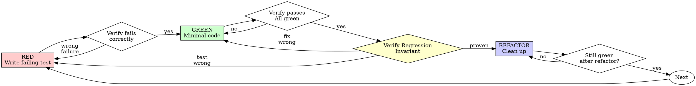

# Test-Driven Development (TDD)

## Overview

Write the test first. Watch it fail. Write minimal code to pass.

**Core principle:** If you didn't watch the test fail, you don't know if it tests the right thing.

**Violating the letter of the rules is violating the spirit of the rules.**

## When to Use

**Always:**
- New features
- Bug fixes
- Refactoring
- Behavior changes

**Exceptions (ask your human partner):**
- Throwaway prototypes
- Generated code
- Configuration files

Thinking "skip TDD just this once"? Stop. That's rationalization.

## The Iron Law

```
NO PRODUCTION CODE WITHOUT A FAILING TEST FIRST
```

Write code before the test? Delete it. Start over.

**No exceptions:**
- Don't keep it as "reference"
- Don't "adapt" it while writing tests
- Don't look at it
- Delete means delete

Implement fresh from tests. Period.

## Red-Green-Refactor



### RED - Write Failing Test

Write one minimal test showing what should happen.

<Good>
```typescript
test('retries failed operations 3 times', async () => {
  let attempts = 0;
  const operation = () => {
    attempts++;
    if (attempts < 3) throw new Error('fail');
    return 'success';
  };

  const result = await retryOperation(operation);

  expect(result).toBe('success');
  expect(attempts).toBe(3);
});
```
Clear name, tests real behavior, one thing
</Good>

<Bad>
```typescript
test('retry works', async () => {
  const mock = jest.fn()
    .mockRejectedValueOnce(new Error())
    .mockRejectedValueOnce(new Error())
    .mockResolvedValueOnce('success');
  await retryOperation(mock);
  expect(mock).toHaveBeenCalledTimes(3);
});
```
Vague name, tests mock not code
</Bad>

**Requirements:**
- One behavior
- Clear name
- Real code (no mocks unless unavoidable)

### Verify RED - Watch It Fail

**MANDATORY. Never skip.**

```bash
npm test path/to/test.test.ts
```

Confirm:
- Test fails (not errors)
- Failure message is expected
- Fails because feature missing (not typos)

**Test passes?** You're testing existing behavior. Fix test.

**Test errors?** Fix error, re-run until it fails correctly.

### GREEN - Minimal Code

Write simplest code to pass the test.

<Good>
```typescript
async function retryOperation<T>(fn: () => Promise<T>): Promise<T> {
  for (let i = 0; i < 3; i++) {
    try {
      return await fn();
    } catch (e) {
      if (i === 2) throw e;
    }
  }
  throw new Error('unreachable');
}
```
Just enough to pass
</Good>

<Bad>
```typescript
async function retryOperation<T>(
  fn: () => Promise<T>,
  options?: {
    maxRetries?: number;
    backoff?: 'linear' | 'exponential';
    onRetry?: (attempt: number) => void;
  }
): Promise<T> {
  // YAGNI
}
```
Over-engineered
</Bad>

Don't add features, refactor other code, or "improve" beyond the test.

### Verify GREEN - Watch It Pass

**MANDATORY.**

```bash
npm test path/to/test.test.ts
```

Confirm:
- Test passes
- Other tests still pass
- Output pristine (no errors, warnings)

**Test fails?** Fix code, not test.

**Other tests fail?** Fix now.

### Verify Regression Invariant — Prove the Test Catches the Bug

After GREEN, before REFACTOR: prove the test actually catches the bug it gates.
This step corresponds to the `verify_invariant` node in the diagram above — the path is `verify_green → verify_invariant → refactor`.

1. **Revert** the production code change (just the fix — leave the test in place).
2. **Run the new test.**
   **Must FAIL** with a clear message that ties to the bug.
   If it passes with the fix reverted, the test doesn't exercise the fix path.
   Two possible causes:
   - **Test is structured wrong** → go back to RED, rewrite the test.
   - **Fix doesn't address the root cause** → go back to GREEN, rethink the fix.
   Stop and rethink before proceeding.
3. **Restore** the fix.
4. **Run the test again.**
   **Must PASS.**
5. **Document the proof in the PR body.** Paste the relevant lines:

   ```
   With fix reverted:
   $ <test run command>
     FAIL — <message that names the bug>

   With fix restored:
   $ <test run command>
     PASS
   ```

**Why:** a passing test proves nothing without this check. The test might pass for the wrong reason — it uses the same broken code path, mocks the bug away, or tests a tangentially-correct property. The revert-and-restore proof is the only way to know the test would have caught the bug if it had been shipped before the fix.

**Iron Law (extension):** No claim of "test catches regression" without revert-and-restore proof in the PR body.

### REFACTOR - Clean Up

After green only:
- Remove duplication
- Improve names
- Extract helpers

Keep tests green. Don't add behavior.

**Note:** The Verify Regression Invariant step applies once per bug fix (after the initial GREEN), not after each refactor cycle. Refactoring must not change the fix path — if it does, that's a new production code change requiring a new test.

### Repeat

Next failing test for next feature.

## Good Tests

| Quality | Good | Bad |
|---------|------|-----|
| **Minimal** | One thing. "and" in name? Split it. | `test('validates email and domain and whitespace')` |
| **Clear** | Name describes behavior | `test('test1')` |
| **Shows intent** | Demonstrates desired API | Obscures what code should do |

## Why Order Matters

**"I'll write tests after to verify it works"**

Tests written after code pass immediately. Passing immediately proves nothing:
- Might test wrong thing
- Might test implementation, not behavior
- Might miss edge cases you forgot
- You never saw it catch the bug

Test-first forces you to see the test fail, proving it actually tests something.

**"I already manually tested all the edge cases"**

Manual testing is ad-hoc. You think you tested everything but:
- No record of what you tested
- Can't re-run when code changes
- Easy to forget cases under pressure
- "It worked when I tried it" ≠ comprehensive

Automated tests are systematic. They run the same way every time.

**"Deleting X hours of work is wasteful"**

Sunk cost fallacy. The time is already gone. Your choice now:
- Delete and rewrite with TDD (X more hours, high confidence)
- Keep it and add tests after (30 min, low confidence, likely bugs)

The "waste" is keeping code you can't trust. Working code without real tests is technical debt.

**"TDD is dogmatic, being pragmatic means adapting"**

TDD IS pragmatic:
- Finds bugs before commit (faster than debugging after)
- Prevents regressions (tests catch breaks immediately)
- Documents behavior (tests show how to use code)
- Enables refactoring (change freely, tests catch breaks)

"Pragmatic" shortcuts = debugging in production = slower.

**"Tests after achieve the same goals - it's spirit not ritual"**

No. Tests-after answer "What does this do?" Tests-first answer "What should this do?"

Tests-after are biased by your implementation. You test what you built, not what's required. You verify remembered edge cases, not discovered ones.

Tests-first force edge case discovery before implementing. Tests-after verify you remembered everything (you didn't).

30 minutes of tests after ≠ TDD. You get coverage, lose proof tests work.

## When the Bug Is a Class Invariant Violation

A common pattern: one method of a sibling-method group violates a convention the rest of the group follows. The fix is local; the bug is structural.

**Heuristic — does this apply?**

- Is there a sibling-method group? (Several methods on the same struct, the same handler family, the same RPC service, the same hook table.)
- Does the bug stem from the buggy method failing to follow a convention the rest of the group already follows?
- Could a future method drift the same way?

If two or more are yes: the regression test must cover ALL sibling methods — not just the buggy one. Pattern: table-driven test with one entry per sibling method, each asserting the invariant.

**Why:** fixing only the buggy method leaves the bug class open. The next method that drifts ships the same bug. The test must gate the class, not the instance.

**Concrete example (generic):**

A `Dispatcher` struct has methods `Create`, `Read`, `Update`, `Delete`, `Inspect`. Each calls `client.Send(...)` with an args map that must include `"kind": d.kind`. `Inspect` is new and omits `kind`. The fix is one line — but the regression test should be:

```go
// Regression gate for the class invariant: every Dispatcher method must
// include "kind" in its Send args.
// IMPORTANT: add a new row to cases whenever a new method is added —
// the test only gates methods explicitly listed here.
func TestDispatcher_AllMethods_IncludeKind(t *testing.T) {
    req := Request{Name: "test-resource"} // illustrative; use your actual Request type
    cases := []struct {
        name string
        call func(d *Dispatcher) error
    }{
        {"Create",  func(d *Dispatcher) error { return d.Create(req) }},
        {"Read",    func(d *Dispatcher) error { return d.Read(req) }},
        {"Update",  func(d *Dispatcher) error { return d.Update(req) }},
        {"Delete",  func(d *Dispatcher) error { return d.Delete(req) }},
        {"Inspect", func(d *Dispatcher) error { return d.Inspect(req) }},
    }
    for _, tc := range cases {
        t.Run(tc.name, func(t *testing.T) {
            spy := &spyClient{} // spyClient is a test double; implement lastArgs as map[string]string
            d := &Dispatcher{client: spy, kind: "widget"}
            if err := tc.call(d); err != nil {
                t.Fatalf("unexpected error: %v", err)
            }
            if spy.lastArgs["kind"] != "widget" {
                t.Errorf("%s: missing or wrong kind in args", tc.name)
            }
        })
    }
}
```

The next method that drifts the same way fails this test on first commit.

**Regression Invariant check for class-invariant tests:** after GREEN, apply the revert-and-restore proof to the table-driven test: revert only the previously-broken method so the overall test fails (its row fails; correct siblings still pass), then restore it so the full table passes again. Optionally, temporarily introduce the same invariant violation into a known-good sibling to prove its row would also fail, then restore both and confirm the table is green.

## When the Change Crosses an Interface Boundary

An interface boundary is any point where two independent components exchange data or control: producer→consumer, caller→callee, plugin→host, sender→handler (see `agents/boundary-classes.md` for the canonical list with examples). When a change introduces or modifies a contract across such a boundary, both sides require test coverage — and at least one test must exercise the full crossing end-to-end. The heuristic below helps identify when this applies, including cases where only one side has been modified so far.

**Why independent unit tests on each side are insufficient:** each side's unit test mocks the other. If the contract between them drifts (wrong field name, wrong type, wrong call sequence), both unit tests continue to pass while the integration is broken. The end-to-end test is the only gate that catches contract drift.

**Heuristic — does this apply?**

- Does the change add a new method, field, event type, or hook?
- Does that addition exist on one side (producer/server/plugin) and need to be consumed on another (consumer/client/host)?
- Would either side compile and pass its unit tests even if the other side had not been updated?

If two or more are yes: the task is not complete until both sides are wired and a test exercises the full crossing.

**Coverage rule:**
1. Unit test the producer side (asserts it emits the new method/field/hook correctly).
2. Unit test the consumer side (asserts it handles the new method/field/hook correctly).
3. Integration test the crossing (no mocks on either side of the boundary; a real call from producer to consumer).

**Red flags for one-sided wiring:**
- The PR only modifies files on one side of the boundary.
- Tests on the consumer side mock the producer with a hardcoded stub that was never updated to match the new contract.
- The new method/field/hook is added to the producer but the consumer has a `// TODO: handle` comment.

## Common Rationalizations

| Excuse | Reality |
|--------|---------|
| "Too simple to test" | Simple code breaks. Test takes 30 seconds. |
| "I'll test after" | Tests passing immediately prove nothing. |
| "Tests after achieve same goals" | Tests-after = "what does this do?" Tests-first = "what should this do?" |
| "Already manually tested" | Ad-hoc ≠ systematic. No record, can't re-run. |
| "Deleting X hours is wasteful" | Sunk cost fallacy. Keeping unverified code is technical debt. |
| "Keep as reference, write tests first" | You'll adapt it. That's testing after. Delete means delete. |
| "Need to explore first" | Fine. Throw away exploration, start with TDD. |
| "Test hard = design unclear" | Listen to test. Hard to test = hard to use. |
| "TDD will slow me down" | TDD faster than debugging. Pragmatic = test-first. |
| "Manual test faster" | Manual doesn't prove edge cases. You'll re-test every change. |
| "Existing code has no tests" | You're improving it. Add tests for existing code. |

## Proper Solution, Not Just Passing Tests

A test passing proves the symptom is gone — not that the root cause is fixed.

**The shortcut-bias trap:** an implementer adds a nil-guard, a special case, or a retry loop. Tests go green. The underlying defect is still present — only its visible expression is suppressed. Future changes re-expose it.

**The check:** apply the revert-and-restore proof (per the Verify Regression Invariant step above, between GREEN and REFACTOR): revert only the root-cause fix while keeping the symptom suppressor, then run the tests. If the tests still pass, the test does not gate the actual bug — rewrite it to target the root cause directly, then restore the fix and confirm GREEN.

**Examples:**
- A function returns nil when called with malformed input. The fix adds `if result == nil { return defaultValue }` at the call site. The test passes. The function still returns nil — the callee is broken, but the caller hides it. A proper test exercises the function directly and asserts it never returns nil for valid inputs.
- A concurrent write causes a data race. The fix adds a sleep before the assertion. The test passes (sometimes). The race still exists. A proper fix removes the race; a proper test uses synchronization primitives, not timing.

**Regression-invariant corollary:** during the revert-and-restore proof (Verify Regression Invariant step, between GREEN and REFACTOR), verify the test fails because of the root cause, not a side-effect. If you cannot identify which line of production code causes the failure, the test is not precise enough.

## Red Flags - STOP and Start Over

- Code before test
- Test after implementation
- Test passes immediately
- Can't explain why test failed
- Tests added "later"
- Rationalizing "just this once"
- "I already manually tested it"
- "Tests after achieve the same purpose"
- "It's about spirit not ritual"
- "Keep as reference" or "adapt existing code"
- "Already spent X hours, deleting is wasteful"
- "TDD is dogmatic, I'm being pragmatic"
- "This is different because..."

**All of these mean: Delete code. Start over with TDD.**

## Example: Bug Fix

**Bug:** Empty email accepted

**RED**
```typescript
test('rejects empty email', async () => {
  const result = await submitForm({ email: '' });
  expect(result.error).toBe('Email required');
});
```

**Verify RED**
```bash
$ npm test
FAIL: expected 'Email required', got undefined
```

**GREEN**
```typescript
function submitForm(data: FormData) {
  if (!data.email?.trim()) {
    return { error: 'Email required' };
  }
  // ...
}
```

**Verify GREEN**
```bash
$ npm test
PASS
```

**Verify Regression Invariant**

Revert the fix (`if (!data.email?.trim()) ...` removed). Run test:
```bash
$ npm test
FAIL: expected 'Email required', got undefined
```

Restore the fix. Run test:
```bash
$ npm test
PASS
```

Proof pasted in PR body: "With fix reverted: FAIL — expected 'Email required', got undefined. With fix restored: PASS."

**REFACTOR**
Extract validation for multiple fields if needed.

## Verification Checklist

Before marking work complete:

- [ ] Every new function/method has a test
- [ ] Watched each test fail before implementing
- [ ] Each test failed for expected reason (feature missing, not typo)
- [ ] Wrote minimal code to pass each test
- [ ] All tests pass
- [ ] Output pristine (no errors, warnings)
- [ ] Tests use real code (mocks only if unavoidable)
- [ ] Edge cases and errors covered
- [ ] Performed revert-and-restore proof for each new regression test (Verify Regression Invariant)

Can't check all boxes? You skipped TDD. Start over.

## When Stuck

| Problem | Solution |
|---------|----------|
| Don't know how to test | Write wished-for API. Write assertion first. Ask your human partner. |
| Test too complicated | Design too complicated. Simplify interface. |
| Must mock everything | Code too coupled. Use dependency injection. |
| Test setup huge | Extract helpers. Still complex? Simplify design. |

## Debugging Integration

Bug found? Write failing test reproducing it. Follow TDD cycle. Test proves fix and prevents regression.

Never fix bugs without a test.

## Testing Anti-Patterns

When adding mocks or test utilities, read @testing-anti-patterns.md to avoid common pitfalls:
- Testing mock behavior instead of real behavior
- Adding test-only methods to production classes
- Mocking without understanding dependencies

## Final Rule

```
Production code → test exists and failed first
Otherwise → not TDD
```

No exceptions without your human partner's permission.
