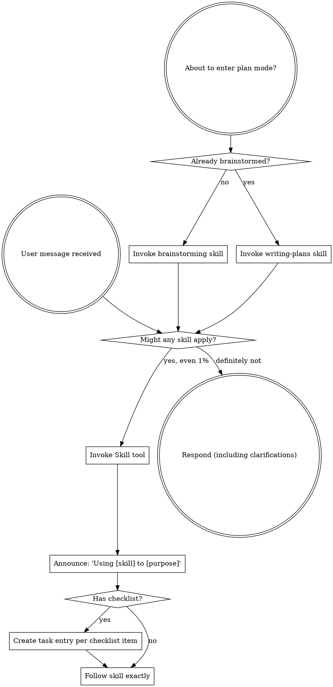

<EXTREMELY-IMPORTANT>
If you think there is even a 1% chance a skill might apply to what you are doing, you ABSOLUTELY MUST invoke the skill.

IF A SKILL APPLIES TO YOUR TASK, YOU DO NOT HAVE A CHOICE. YOU MUST USE IT.

This is not negotiable. This is not optional. You cannot rationalize your way out of this.
</EXTREMELY-IMPORTANT>

## How to Access Skills

**In Claude Code:** Use the `Skill` tool. When you invoke a skill, its content is loaded and presented to you—follow it directly. Never use the Read tool on skill files.

**In other environments:** Check your platform's documentation for how skills are loaded.

# Using Skills

## The Rule

**Invoke relevant or requested skills BEFORE any response or action.** Even a 1% chance a skill might apply means that you should invoke the skill to check. If an invoked skill turns out to be wrong for the situation, you don't need to use it.

## Red Flags

These thoughts mean STOP—you're rationalizing:

| Thought | Reality |
|---------|---------|
| "This is just a simple question" | Questions are tasks. Check for skills. |
| "I need more context first" | Skill check comes BEFORE clarifying questions. |
| "Let me explore the codebase first" | Skills tell you HOW to explore. Check first. |
| "I can check git/files quickly" | Files lack conversation context. Check for skills. |
| "Let me gather information first" | Skills tell you HOW to gather information. |
| "This doesn't need a formal skill" | If a skill exists, use it. |
| "I remember this skill" | Skills evolve. Read current version. |
| "This doesn't count as a task" | Action = task. Check for skills. |
| "The skill is overkill" | Simple things become complex. Use it. |
| "I'll just do this one thing first" | Check BEFORE doing anything. |
| "This feels productive" | Undisciplined action wastes time. Skills prevent this. |
| "I know what that means" | Knowing the concept ≠ using the skill. Invoke it. |

## Skill Priority

When multiple skills could apply, use this order:

1. **Process skills first** (brainstorming, debugging) - these determine HOW to approach the task
2. **Implementation skills second** (frontend-design, mcp-builder) - these guide execution
3. **Pipeline skills auto-chain** — these invoke each other automatically in the autonomous pipeline:
   brainstorming → adversarial-design-review (design phase) → writing-plans → adversarial-design-review (plan phase) → alignment-check → **scope-lock** → subagent-driven-development → finishing-a-development-branch → pr-monitoring → post-merge-retrospective

   Cross-cutting skills invoked from within the pipeline when conditions trigger: `recording-decisions` (when designs/plans make non-trivial trade-offs, including user-approved scope reductions); `scope-lock` (re-checked at every per-task checkpoint and before PR creation).

"Let's build X" → brainstorming first, then the pipeline runs autonomously after design approval.
"Fix this bug" → debugging first, then domain-specific skills.

## Skill Types

**Rigid** (TDD, debugging): Follow exactly. Don't adapt away discipline.

**Flexible** (patterns): Adapt principles to context.

The skill itself tells you which.

## User Instructions

Instructions say WHAT, not HOW. "Add X" or "Fix Y" doesn't mean skip workflows.

### Strict-interpretation invariant (autonomous mode)

When the autonomous pipeline is running and a user instruction is **ambiguous**, the agent MUST pick the **most-faithful-to-the-locked-plan** interpretation. Picking the looser interpretation in the name of "being helpful" is the failure mode this rule exists to prevent.

| Phrase | ❌ Loose interpretation (forbidden) | ✅ Strict interpretation (mandated) |
|---|---|---|
| "reorder as needed" | rescope, drop tasks, change PR count | reorder tasks within the same PR; manifest unchanged |
| "create a PR" | create one PR for whatever subset is convenient | create the number of PRs in the manifest's PR Grouping table |
| "test locally" | skip CI; ship something that "works on my machine" | run the verification steps every plan task declares; CI still runs at the end |
| "make it work" / "just get something working" | trim scope until the partial result runs | implement the full manifest; if blocked, surface the blocker |
| "ship a demo" | partial scope + happy-path-only tests | there is no demo mode; either ship the locked manifest or invoke the unlock path |
| "do whatever you think is best" | unilaterally restructure plan | do the locked manifest; surface choices not covered by the manifest |
| "be efficient" / "be quick" | drop tests, drop reviews, drop tasks | run the pipeline at full discipline; speed comes from parallelism, not from skipping |

**When multiple strict interpretations remain plausible**, the agent stops and asks. Picking one and proceeding is not allowed. The cheapest place to catch a misinterpretation is before any commit; the most expensive is after a PR is opened.

**Locked plans are inviolate.** If the user phrase appears to conflict with the locked manifest in `docs/plans/<feature>.md`, the locked manifest wins until the user goes through the unlock path defined in `skills/scope-lock/SKILL.md`. "I told you to reorder" does not retroactively authorize rescoping; "yes, drop tasks 4 and 5" does (and triggers `recording-decisions`).

This rule is **rigid**, not flexible. Do not adapt it. The whole point is that ambiguity is resolved upward, never sideways.
